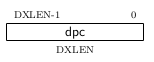

# RISC-V External Debug Support

Version 0.13.2

```txt
本ドキュメントは次のURLのドキュメントを自己の勉強用に訳しているものです。

https://riscv.org/specifications/debug-specification/

ほとんどはgoogle翻訳に通しただけのものですが解釈違いを起こしている箇所があっても一切の責任を負いません。

本ドキュメントをMarkdownで記述しており、Markdownのコードブロック内の内容は解釈の注意や解釈時の感想などです。
途中にp.Xとあるのはドキュメントのページ番号です。
```

###### p.1

# Chapter 1 Introduction

When a design progresses from simulation to hardware implementation, a user’s control and un-derstanding of the system’s current state drops dramatically.
```設計がシミュレーションからハードウェア実装に進むと、ユーザーの制御とシステムの現在の状態に対する理解が劇的に低下します。```
To help bring up and debug low level software and hardware, it is critical to have good debugging support built into the hardware.
```低レベルのソフトウェアやハードウェアを起動してデバッグするためには、ハードウェアに優れたデバッグサポートを組み込むことが重要です。```
When a robust OS is running on a core, software can handle many debugging tasks.
```堅牢なOSがコア上で実行されている場合、ソフトウェアは多くのデバッグタスクを処理できます。```
However, in many scenarios, hardware support is essential.
```ただし、多くの場合、ハードウェアサポートは不可欠です。```

This document outlines a standard architecture for external debug support on RISC-V platforms.
```この資料はRISC-Vプラットフォームの外部デバッグサポートのための標準的なアーキテクチャを概説したものです。```
This architecture allows a variety of implementations and tradeoffs, which is complementary to the wide range of RISC-V implementations.
```このアーキテクチャは、さまざまなRISC-V実装を補完する、さまざまな実装やトレードオフを可能にします。```
At the same time, this specification defines common interfaces to allow debugging tools and components to target a variety of platforms based on the RISC-V ISA.
```同時に、この仕様では、デバッグツールやコンポーネントがRISC-V ISAをベースにしたさまざまなプラットフォームをターゲットにできるように、共通のインタフェースを定義しています。```

System designers may choose to add additional hardware debug support, but this specification defines a standard interface for common functionality.
```システム設計者はハードウェアデバッグサポートを追加することを選択するかもしれませんが、この仕様は一般的な機能のための標準インタフェースを定義します。```

## 1.1 Terminology

A platform is a single integrated circuit consisting of one or more components.
Some components may be RISC-V cores, while others may have a different function.
Typically they will all be connected to a single system bus. A single RISC-V core contains one or more hardware threads, called harts.
DXLEN of a hart is its widest supported XLEN, ignoring the current value of MXL in misa.
プラットフォームは、1つ以上のコンポーネントで構成される単一の集積回路です。
一部のコンポーネントはRISC-Vコアですが、その他のコンポーネントは異なる機能を持つ場合があります。
通常、それらはすべて単一のシステムバスに接続されます。 単一のRISC-Vコアには、ハートと呼ばれる1つ以上のハードウェアスレッドが含まれています。
ハートのDXLENは、misaのMXLの現在の値を無視して、その最も広くサポートされているXLENです。

```txt
ハートは「ハードウェア・スレッド」であり、「コア」と明言していないことに注意しなければいけないだろう。
```

### 1.1.1 Context

This document is written to work with:
```この文書は以下のものと共に機能するように書かれています。```

1. The RISC-V Instruction Set Manual, Volume I: User-Level ISA, Document Version 2.2 (the ISA Spec)
   ```RISC-V命令セットマニュアル第1巻：ユーザーレベルのISA、文書バージョン2.2（ISA規格）```

###### p.2

1. The RISC-V Instruction Set Manual, Volume II: Privileged Architecture, Version 1.10 (the Privileged Spec)
   ```RISC-V命令セットマニュアル第2巻：特権アーキテクチャ、バージョン1.10（特権仕様）```

### 1.1.2 Versions

Version 0.13 of this document was ratified by the RISC-V Foundation’s board.
Versions 0.13.x are bug fix releases to that ratified specification.
Version 0.14 will be forwards and backwards compatible with Version 0.13.
この文書のバージョン0.13は、RISC-V財団の理事会によって承認されました。
バージョン0.13.xはその批准された仕様へのバグ修正リリースです。
バージョン0.14はバージョン0.13との互換性があります。

## 1.2 About This Document

### 1.2.1 Structure

This document contains two parts.
```この文書には2つの部分があります。```
The main part of the document is the specification, which is given in the numbered sections.
```この文書の主要部分は仕様であり、それは番号付きセクションに示されています。```
The second part of the document is a set of appendices.
```この文書の2番目の部分は一連の付録です。```
The information in the appendices is intended to clarify and provide examples, but is not part of the actual specification.
```付録の情報は、例を明確にして提供することを目的としていますが、実際の仕様の一部ではありません。```

### 1.2.2 Register Definition Format

All register definitions in this document follow the format shown below.
A simple graphic shows which fields are in the register. The upper and lower bit indices are shown to the top left and top right of each field.
The total number of bits in the field are shown below it.
After the graphic follows a table which for each field lists its name, description, allowed accesses, and reset value.
The allowed accesses are listed in Table 1.2.
The reset value is either a constant or “Preset.”
The latter means it is an implementation-specific legal value.
Names of registers and their fields are hyperlinks to their definition, and are also listed in the index on page 82.
この文書内のすべてのレジスタ定義は以下に示すフォーマットに従います。
単純なグラフィックは、どのフィールドがレジスターにあるかを示します。
上位および下位のビットインデックスは、各フィールドの左上と右上に表示されます。 フィールドの合計ビット数はその下に表示されます。
グラフィックの後に、各フィールドの名前、説明、許可されたアクセス、およびリセット値をリストした表が続きます。 許可されているアクセスを表1.2に示します。
リセット値は定数または「プリセット」のどちらかです。後者は実装固有の有効な値です。
レジスタ名とそのフィールドはそれらの定義へのハイパーリンクであり、82ページのインデックスにもリストされています。

#### 1.2.2.1 Long Name (shortname, at 0x123)

###### p.3

## 1.3 Background

There are several use cases for dedicated debugging hardware, both internal to a CPU core and with an external connection.
```CPUコアの内部と外部接続の両方で、専用のデバッグハードウェアの使用例がいくつかあります。```
This specification addresses the use cases listed below.
```この仕様は、以下にリストするユースケースに対応しています。```
Implementations can choose not to implement every feature, which means some use cases might not be supported.
```実装では、すべての機能を実装しないことを選択できます。つまり、一部のユースケースはサポートされない可能性があります。```

* Debugging low-level software in the absence of an OS or other software.
* Debugging issues in the OS itself.
* Bootstrapping a system to test, configure, and program components before there is any executable code path in the system.
* Accessing hardware on a system without a working CPU.

In addition, even without a hardware debugging interface, architectural support in a RISC-V CPU can aid software debugging and performance analysis by allowing hardware triggers and breakpoints.

## 1.4 Supported Features

The debug interface described in this specification supports the following features:
```この仕様で説明されているデバッグインターフェイスは、次の機能をサポートしています。```

1. All hart registers (including CSRs) can be read/written.
2. Memory can be accessed either from the hart’s point of view, through the system bus directly, or both.
3. RV32, RV64, and future RV128 are all supported.
4. Any hart in the platform can be independently debugged.
5. A debugger can discover almost 1 everything it needs to know itself, wit

note.1 Notable exceptions include information about the memory map and peripherals.
note.1 注目すべき例外には、メモリマップと周辺機器に関する情報が含まれます。

###### p.4

6. Each hart can be debugged from the very first instruction executed.
7. A RISC-V hart can be halted when a software breakpoint instruction is executed.
8. Hardware single-step can execute one instruction at a time.
9. Debug functionality is independent of the debug transport used.
10. The debugger does not need to know anything about the microarchitecture of the harts it is debugging.
11. Arbitrary subsets of harts can be halted and resumed simultaneously. (Optional)
12. Arbitrary instructions can be executed on a halted hart. That means no new debug function- ality is needed when a core has additional or custom instructions or state, as long as there exist programs that can move that state into GPRs. (Optional)
13. Registers can be accessed without halting. (Optional)
14. A running hart can be directed to execute a short sequence of instructions, with little overhead. (Optional)
15. A system bus master allows memory access without involving any hart. (Optional)
16. A RISC-V hart can be halted when a trigger matches the PC, read/write address/data, or an instruction opcode. (Optional)

This document does not suggest a strategy or implementation for hardware test, debugging or error detection techniqes. Scan, BIST, etc. are out of scope of this specification, but this specification does not intend to limit their use in RISC-V systems.
It is possible to debug code that uses software threads, but there is no special debug support for it.

###### p.5

# Chapter 2 System Overview

Figure 2.1 shows the main components of External Debug Support. Blocks shown in dotted lines are optional.
The user interacts with the Debug Host (e.g. laptop), which is running a debugger (e.g. gdb).
The debugger communicates with a Debug Translator (e.g. OpenOCD, which may include a hardware driver) to communicate with Debug Transport Hardware (e.g. Olimex USB-JTAG adapter).
The Debug Transport Hardware connects the Debug Host to the Platform’s Debug Transport Module (DTM).
The DTM provides access to one or more Debug Modules (DMs) using the Debug Module Interface (DMI).
Each hart in the platform is controlled by exactly one DM. Harts may be heterogeneous.
There is no further limit on the hart-DM mapping, but usually all harts in a single core are controlled by the same DM.
In most platforms there will only be one DM that controls all the harts in the platform.
DMs provide run control of their harts in the platform.
Abstract commands provide access to GPRs.
Additional registers are accessible through abstract commands or by writing programs to the optional Program Buffer.
The Program Buffer allows the debugger to execute arbitrary instructions on a hart.
This mechanism can also be used to access memory.
An optional system bus access block allows memory accesses without using a RISC-V hart to perform the access.
Each RISC-V hart may implement a Trigger Module.
When trigger conditions are met, harts will halt and inform the debug module that they have halted.
図2.1は、外部デバッグサポートの主要コンポーネントを示しています。
点線で示されているブロックはオプションです。
ユーザーは、デバッガー（gdbなど）を実行しているデバッグホスト（ラップトップなど）と対話します。
デバッガーは、デバッグトランスレーターハードウェア（Olimex USB-JTAGアダプターなど）と通信するために、デバッグトランスレーター（ハードウェアドライバーを含むOpenOCDなど）と通信します。
デバッグトランスポートハードウェアは、デバッグホストをプラットフォームのデバッグトランスポートモジュール（DTM）に接続します。
DTMは、デバッグモジュールインターフェイス（DMI）を使用して1つ以上のデバッグモジュール（DM）へのアクセスを提供します。
プラットフォーム内の各ハートは、厳密に1つのDMによって制御されます。ハートは異質かもしれません。
hart-DMマッピングにはこれ以上の制限はありませんが、通常、単一のコア内のすべてのhartは同じDMによって制御されます。
ほとんどのプラットフォームでは、プラットフォーム内のすべてのハートを制御するDMは1つだけです。
DMは、プラットフォームでハートの実行制御を提供します。
抽象コマンドは、GPRへのアクセスを提供します。
追加のレジスタには、抽象コマンドまたはプログラムをオプションのプログラムバッファに書き込むことでアクセスできます。
プログラムバッファーを使用すると、デバッガーはハートに対して任意の命令を実行できます。
このメカニズムは、メモリへのアクセスにも使用できます。
オプションのシステムバスアクセスブロックを使用すると、RISC-Vハートを使用せずにメモリにアクセスしてアクセスできます。
各RISC-Vハートは、トリガーモジュールを実装できます。
トリガー条件が満たされると、ハートは停止し、デバッグモジュールに停止したことを通知します。


###### p.6


###### p.7

# Chapter 3 Debug Module (DM)

The Debug Module implements a translation interface between abstract debug operations and their specific implementation. It might support the following operations:
デバッグモジュールは、抽象デバッグ操作と特定の実装間の変換インターフェイスを実装します。 次の操作をサポートする場合があります。

1. Give the debugger necessary information about the implementation. (Required)
   デバッガーに実装に関する必要な情報を提供します
2. Allow any individual hart to be halted and resumed. (Required)
   個々のハートの停止と再開を許可します。
3. Provide status on which harts are halted. (Required)
   ハートが停止しているステータスを提供します。
4. Provide abstract read and write access to a halted hart’s GPRs. (Required)
   停止したハートのGPRへの抽象的な読み取りおよび書き込みアクセスを提供します。
5. Provide access to a reset signal that allows debugging from the very first instruction after reset. (Required)
   リセット後の最初の命令からデバッグできるようにするリセット信号へのアクセスを提供します。
6. Provide a mechanism to allow debugging harts immediately out of reset (regardless of the reset cause). (Optional)
   リセットからハートをデバッグできるようにするメカニズムを提供する
7.  Provide abstract access to non-GPR hart registers. (Optional)
   非GPRハートレジスタへの抽象アクセスを提供します。
8.  Provide a Program Buffer to force the hart to execute arbitrary instructions. (Optional)
   ハートに任意の命令を実行させるプログラムバッファを提供します。
9.  Allow multiple harts to be halted, resumed, and/or reset at the same time. (Optional)
    複数のハートを同時に停止、再開、またはリセットできるようにします。
10. Allow memory access from a hart’s point of view. (Optional)
    ハートの視点からのメモリアクセスを許可します。
11. Allow direct System Bus Access. (Optional)
    直接システムバスアクセスを許可します。

In order to be compliant with this specification an implementation must:
この仕様に準拠するためには、実装が以下を行う必要があります。

1. Implement all the required features listed above.
   上記の必須機能をすべて実装します。
2. Implement at least one of Program Buffer, System Bus Access, or Abstract Access Memory command mechanisms.
   プログラムバッファ、システムバスアクセス、または抽象アクセスメモリコマンドメカニズムの少なくとも1つを実装します。
3. Do at least one of:
   以下の少なくとも1つを実行します。
(a) Implement the Program Buffer.
    プログラムバッファを実装します。
(b) Implement abstract access to all registers that are visible to software running on the hart including all the registers that are present on the hart and listed in Table 3.3.
    ハート上に存在し、表3.3にリストされているすべてのレジスタを含む、ハート上で実行されているソフトウェアから見えるすべてのレジスタへの抽象アクセスを実装します。
(c) Implement abstract access to at least all GPRs, dcsr, and dpc, and advertise the implementation as conforming to the “Minimal RISC-V Debug Specification 0.13.2”, instead of the “RISC-V Debug Specification 0.13.2”.
    少なくともすべてのGPR、dcsr、およびdpcへの抽象アクセスを実装し、「RISC-Vデバッグ仕様0.13.2」ではなく「最小RISC-Vデバッグ仕様0.13.2」に準拠するように実装をアドバタイズします。

A single DM can debug up to 2^20 harts.
1つのDMで最大2^20ハートをデバッグできます。

###### p.8

## 3.1 Debug Module Interface (DMI)

Debug Modules are slaves to a bus called the Debug Module Interface (DMI). The master of the bus is the Debug Transport Module(s).
The Debug Module Interface can be a trivial bus with one master and one slave, or use a more full-featured bus like TileLink or the AMBA Advanced Peripheral Bus.
The details are left to the system designer.
デバッグモジュールは、デバッグモジュールインターフェイス（DMI）と呼ばれるバスのスレーブです。 バスのマスターは、デバッグトランスポートモジュールです。
デバッグモジュールインターフェイスは、1つのマスターと1つのスレーブを備えた単純なバスにすることも、TileLinkやAMBA Advanced Peripheral Busなどのフル機能バスを使用することもできます。
詳細はシステム設計者に任されています。

The DMI uses between 7 and 32 address bits.
It supports read and write operations.
The bottom of the address space is used for the first (and usually only) DM.
Extra space can be used for custom debug devices, other cores, additional DMs, etc.
If there are additional DMs on this DMI, the base address of the next DM in the DMI address space is given in nextdm.
DMIは7〜32のアドレスビットを使用します。
読み取りおよび書き込み操作をサポートします。
アドレス空間の下部は、最初の（通常のみ）DMに使用されます。
余分なスペースは、カスタムデバッグデバイス、他のコア、追加のDMなどに使用できます。
このDMIに追加のDMがある場合、DMIアドレス空間内の次のDMのベースアドレスはnextdmで指定されます。

The Debug Module is controlled via register accesses to its DMI address space.
デバッグモジュールは、DMIアドレス空間へのレジスタアクセスを介して制御されます。

## 3.2 Reset Control

The Debug Module controls a global reset signal, ndmreset (non-debug module reset), which can reset, or hold in reset, every component in the platform, except for the Debug Module and Debug Transport Modules.
Exactly what is affected by this reset is implementation dependent, as long as it is possible to debug programs from the first instruction executed.
The Debug Module’s own state and registers should only be reset at power-up and while dmactive in dmcontrol is 0.
The halt state of harts should be maintained across system reset provided that dmactive is 1, although trigger CSRs may be cleared.
デバッグモジュールは、グローバルリセット信号ndmreset（非デバッグモジュールリセット）を制御します。ndmresetは、デバッグモジュールおよびデバッグトランスポートモジュールを除く、プラットフォーム内のすべてのコンポーネントをリセットまたはリセットを保持できます。
実行された最初の命令からプログラムをデバッグできる限り、このリセットの影響は実装に依存します。
デバッグモジュール自体の状態とレジスタは、電源投入時とdmcontrolのdmactiveが0の間にのみリセットする必要があります。
トリガーCSRをクリアすることもできますが、dmactiveが1である場合、ハートリセットの停止状態はシステムリセット後も維持する必要があります。

Due to clock and power domain crossing issues, it may not be possible to perform arbitrary DMI accesses across system reset.
While ndmreset or any external reset is asserted, the only supported DM operation is accessing dmcontrol. The behavior of other accesses is undefined.
クロックおよび電源ドメインの交差の問題により、システムリセット全体で任意のDMIアクセスを実行できない場合があります。
ndmresetまたは外部リセットがアサートされている間、サポートされるDM操作はdmcontrolへのアクセスのみです。 他のアクセスの動作は未定義です。

There is no requirement on the duration of the assertion of ndmreset.
The implementation must ensure that a write of ndmreset to 1 followed by a write of ndmreset to 0 triggers system reset.
The system may take an arbitrarily long time to come out of reset, as reported by allunavail, anyunavail.
ndmresetのアサーションの期間に関する要件はありません。
実装では、ndmresetを1に書き込み、続いてndmresetを0に書き込むと、システムがリセットされるようにする必要があります。
allunavail、anyunavailによって報告されているように、システムがリセットから抜け出すまでに任意の長い時間がかかる場合があります。


Individual harts (or several at once) can be reset by selecting them, setting and then clearing hartreset. In this case an implementation may reset more harts than just the ones that are selected.
The debugger can discover which other harts are reset (if any) by selecting them and checking anyhavereset and allhavereset.
個々のハート（または一度に複数のハート）をリセットするには、ハートを選択して設定し、ハートレセットをクリアします。 この場合、実装は選択されたハートだけではなく、より多くのハートをリセットする場合があります。
デバッガーは、それらを選択してanyhaveresetとallhaveresetをチェックすることにより、リセットされている他のハートがある場合はそれを検出できます。

When harts have been reset, they must set a sticky havereset state bit.
The conceptual havereset state bits can be read for selected harts in anyhavereset and allhavereset in dmstatus.
These bits must be set regardless of the cause of the reset.
The havereset bits for the selected harts can be cleared by writing 1 to ackhavereset in dmcontrol.
The havereset bits may or may not be cleared when dmactive is low.
ハートがリセットされると、スティッキーリセット状態ビットを設定する必要があります。
anyhaveresetおよびdmstatusのallhaveresetで、選択したハートの概念のhavereset状態ビットを読み取ることができます。
これらのビットは、リセットの原因に関係なく設定する必要があります。
選択したハートのhaveresetビットは、dmcontrolのackhaveresetに1を書き込むことでクリアできます。
dmactiveがLowの場合、haveresetビットはクリアされる場合とされない場合があります。

When a hart comes out of reset and haltreq or resethaltreq are set, the hart will immediately enter Debug Mode.
Otherwise it will execute normally.
ハートがリセットから抜け、haltreqまたはresethaltreqが設定されると、ハートはすぐにデバッグモードに入ります。
それ以外の場合は、正常に実行されます。


###### p.9

## 3.3 Selecting Harts

Up to 2^20 harts can be connected to a single DM.
The debugger selects a hart, and then subsequent halt, resume, reset, and debugging commands are specific to that hart.
1つのDMに最大2^20個のハートを接続できます。
デバッガーはハートを選択し、その後の停止、再開、リセット、およびデバッグコマンドはそのハートに固有です。

To enumerate all the harts, a debugger must first determine HARTSELLEN by writing all ones to hartsel (assuming the maximum size) and reading back the value to see which bits were actually set.
Then it selects each hart starting from 0 until either anynonexistent in dmstatus is 1, or the highest index (depending on HARTSELLEN) is reached.
すべてのハートを列挙するには、最初にすべてのハートをhartselに書き込み（最大サイズと仮定）、値を読み取って実際に設定されたビットを確認することにより、デバッガーがHARTSELLENを決定する必要があります。
次に、dmstatusのanynonexistentが1になるか、最高のインデックス（HARTSELLENに依存）に達するまで、0から始まる各ハートを選択します。

The debugger can discover the mapping between hart indices and mhartid by using the interface to read mhartid, or by reading the system’s configuration string.
デバッガーは、インターフェイスを使用してmhartidを読み取るか、システムの構成文字列を読み取ることにより、hartインデックスとmhartid間のマッピングを検出できます。

### 3.3.1 Selecting a Single Hart

All debug modules must support selecting a single hart. 
`すべてのデバッグモジュールは、単一のハートの選択をサポートする必要があります。`
The debugger can select a hart by writing its index to hartsel.
`デバッガは、インデックスをhartselに書き込むことでハートを選択できます。`
Hart indexes start at 0 and are contiguous until the final index.
`Hartインデックスは0から始まり、最終インデックスまで連続しています。`

### 3.3.2 Selecting Multiple Harts

Debug Modules may implement a Hart Array Mask register to allow selecting multiple harts at once.
`デバッグモジュールは、複数のハートを一度に選択できるようにハートアレイマスクレジスタを実装できます。`
The nth bit in the Hart Array Mask register applies to the hart with index n.
`ハート配列マスクレジスタのn番目のビットは、インデックスnのハートに適用されます。`
If the bit is 1 then the hart is selected. 
`ビットが1の場合、ハートが選択されます。`
Usually a DM will have a Hart Array Mask register exactly wide enough to select all the harts it supports, but it’s allowed to tie any of these bits to 0.
`通常、DMには、サポートするすべてのハートを選択するのに十分な幅のハートアレイマスクレジスタがありますが、これらのビットを0に関連付けることができます。`
The debugger can set bits in the hart array mask register using hawindowsel and hawindow, then apply actions to all selected harts by setting hasel. 
`デバッガーは、hawindowselおよびhawindowを使用してhart配列マスクレジスタのビットを設定し、haselを設定することにより、選択したすべてのhartにアクションを適用できます。`
If this feature is supported, multiple harts can be halted, resumed, and reset simultaneously.
`この機能がサポートされている場合、複数のハートを同時に停止、再開、およびリセットできます。`
The state of the hart array mask register is not affected by setting or clearing hasel.
`ハート配列マスクレジスタの状態は、haselの設定またはクリアの影響を受けません。`
Only the actions initiated by dmcontrol can apply to multiple harts at once, Abstract Commands apply only to the hart selected by hartsel.
`dmcontrolによって開始されたアクションのみが複数のハートに一度に適用できます。抽象コマンドはハートによって選択されたハートにのみ適用されます。`

## 3.4 Hart States

Every hart that can be selected is in exactly one of four states.
選択できるすべてのハートは、4つの状態のいずれかになります。
Which state the selected harts are in is reflected by allnonexistent, anynonexistent, allunavail, anyunavail, allrunning, anyrunning, allhalted, and anyhalted.
選択したハートがどの状態にあるかは、allnonexistent、anynonexistent、allunavail、anyunavail、allrunning、anyrunning、allhalted、およびanyhaltedに反映されます。
Harts are nonexistent if they will never be part of this system, no matter how long a user waits.
ユーザーがどれだけ待機したとしても、このシステムの一部にならない場合、ハーツは存在しません。
E.g. in a simple single-hart system only one hart exists, and all others are nonexistent.
例えば。単純なシングルハートシステムでは、ハートは1つだけ存在し、他のハートはすべて存在しません。
Debuggers may assume that a system has no harts with indexes higher than the first nonexistent one.
デバッガは、システムに存在しない最初のインデックスよりも高いインデックスを持つハートがないと想定する場合があります。
Harts are unavailable if they might exist/become available at a later time, or if there are other harts with higher indexes than this one.
ハートが存在する可能性がある場合、または後で利用可能になる場合、またはこのインデックスよりも高いインデックスを持つハートが他にある場合、ハートは使用できません。
Harts may be unavailable for a variety of reasons including being reset, temporarily powered down, and not being plugged into the system.
リセット、一時的な電源切断、システムへの接続なしなど、さまざまな理由でハートが利用できない場合があります。
Systems with very large number of harts may permanently disable some during manufacturing, leaving holes in the otherwise continuous hart index space.
非常に多数のハートを持つシステムは、製造中に一部を永続的に無効にし、それ以外の場合は連続したハートインデックススペースに穴を残すことがあります。
In order to let the debugger discover all harts, they must show up as unavailable even if there is no chance of them ever becoming available.
デバッガーがすべてのハートを検出できるようにするには、それらが使用可能になる可能性がなくても、使用不可として表示する必要があります。
Harts are running when they are executing normally, as if no debugger was attached.
デバッガーが接続されていないかのように、正常に実行しているときにハートが実行されています。
This includes being in a low power mode or waiting for an interrupt, as long as a halt request will result in the hart being halted.
これには、停止要求によってハートが停止する限り、低電力モードになるか、割り込みを待つことが含まれます。
Harts are halted when they are in Debug Mode, only performing tasks on behalf of the debugger.
ハートは、デバッグモードのときに停止し、デバッガに代わってタスクを実行するだけです。
Which states a hart that is reset goes through is implementation dependent.
リセットされたハートがどの状態を通過するかは、実装に依存します。
Harts may be un-available while reset is asserted, and some time after reset is deasserted.
リセットがアサートされている間、およびリセットがディアサートされてからしばらくすると、ハートが利用できなくなる場合があります。
They might transition to running for some time after reset is deasserted.
リセットがディアサートされた後、しばらくの間実行に移行する場合があります。
Finally they end up either running or halted, depending on haltreq and resethaltreq.
最後に、haltreqおよびresethaltreqに応じて、実行または停止のいずれかになります。


###### p.10


## 3.5 Run Control

For every hart, the Debug Module tracks 4 conceptual bits of state: halt request, resume ack, halt-on-reset request, and hart reset.
デバッグモジュールは、すべてのハートに対して、状態の4つの概念ビットを追跡します：停止要求、ACKの再開、リセット時の停止要求、およびハートリセット。
(The hart reset and halt-on-reset request bits are optional.)
（ハートリセットおよびリセット時停止要求ビットはオプションです。）
These 4 bits reset to 0, except for resume ack, which may reset to either 0 or 1.
これらの4ビットは0にリセットされますが、再開ackは例外です。再開ackは0または1にリセットされる場合があります。
The DM receives halted,
running, and havereset signals from each hart. The debugger can observe the state of resume ack in allresumeack and anyresumeack, and the state of halted, running, and havereset signals in allhalted, anyhalted, allrunning, anyrunning, allhavereset, and anyhavereset.
実行し、各ハートからのリセット信号を持っています。デバッガーは、allresumeackおよびanyresumeackの再開ackの状態、allhalted、anyhalted、allrunning、anyrunning、allhavereset、およびanyhaveresetのhalt、running、およびhaveresetシグナルの状態を監視できます。
The state of the other bits cannot be observed directly.
他のビットの状態は直接観測できません。
When a debugger writes 1 to haltreq, each selected hart’s halt request bit is set.
デバッガーがhaltreqに1を書き込むと、選択された各ハートの停止要求ビットが設定されます。
When a running hart, or a hart just coming out of reset, sees its halt request bit high, it responds by halting, deasserting its running signal, and asserting its halted signal.
実行中のハート、またはリセットから出たばかりのハートが停止要求ビットをハイにすると、停止し、実行中の信号をディアサートし、停止した信号をアサートして応答します。
Halted harts ignore their halt request bit.
停止したハートは、停止要求ビットを無視します。
When a debugger writes 1 to resumereq, each selected hart’s resume ack bit is cleared and each selected, halted hart is sent a resume request.
デバッガーがresumereqに1を書き込むと、選択された各ハートの再開確認ビットがクリアされ、選択された各停止ハートに再開要求が送信されます。
Harts respond by resuming, clearing their halted signal, and asserting their running signal.
ハートは、再開し、停止した信号をクリアし、実行中の信号をアサートすることで応答します。
At the end of this process the resume ack bit is set.
このプロセスの最後に、再開確認ビットが設定されます。
These status signals of all selected harts are reflected in allresumeack, anyresumeack, allrunning, and anyrunning.
選択されたすべてのハートのステータス信号は、allresumeack、anyresumeack、allrunning、およびanyrunningに反映されます。
Resume requests are ignored by running harts.
hartsを実行すると、再開要求は無視されます。
When halt or resume is requested, a hart must respond in less than one second, unless it is unavailable.
停止または再開が要求された場合、ハートが利用できない場合を除き、ハートは1秒未満で応答する必要があります。
(How this is implemented is not further specified.
（これがどのように実装されるかは、さらに指定されていません。
A few clock cycles will be a more typical latency).
数クロックサイクルがより典型的なレイテンシになります）。
The DM can implement optional halt-on-reset bits for each hart, which it indicates by setting hasresethaltreq to 1.
DMは、各ハートにオプションのリセット時停止ビットを実装できます。これは、hasresethaltreqを1に設定することで示されます。
This means the DM implements the setresethaltreq and clrresethaltreq bits.
これは、DMがsetresethaltreqおよびclrresethaltreqビットを実装することを意味します。
Writing 1 to setresethaltreq sets the halt-on-reset request bit for each selected hart.
setresethaltreqに1を書き込むと、選択した各ハートのリセット時停止要求ビットが設定されます。
When a hart’s halt-on-reset request bit is set, the hart will immediately enter debug mode on the next deassertion of its reset.
ハートのリセット時停止要求ビットが設定されている場合、ハートはリセットの次のディアサートですぐにデバッグモードに入ります。
This is true regardless of the reset’s cause.
これは、リセットの原因に関係なく当てはまります。
The hart’s halt-on-reset request bit remains set until cleared by the debugger writing 1 to clrresethaltreq while the hart is selected, or by DM reset.
ハートが選択されている間にデバッガがclrresethaltreqに1を書き込むか、DMリセットによってクリアされるまで、ハートのリセット時停止要求ビットはセットされたままです。


###### p.11

## 3.6 Abstract Commands

The DM supports a set of abstract commands, most of which are optional.
DMは、一連の抽象コマンドをサポートしていますが、そのほとんどはオプションです。
Depending on the implementation, the debugger may be able to perform some abstract commands even when the selected hart is not halted.
実装によっては、選択したハートが停止していない場合でも、デバッガーはいくつかの抽象コマンドを実行できる場合があります。
Debuggers can only determine which abstract commands are supported by a given hart in a given state by attempting them and then looking at cmderr in abstractcs to see if they were successful.
デバッガーは、特定の状態で特定のhartがサポートしている抽象コマンドのみを試行し、abstractcsのcmderrを見て、成功したかどうかを確認できます。
Commands may be supported with some options set, but not with other options set.
一部のオプションセットではコマンドがサポートされますが、他のオプションセットではサポートされません。
If a command has unsupported options set, the DM must set cmderr to 2 (not supported).
コマンドにサポートされていないオプションが設定されている場合、DMはcmderrを2に設定する必要があります（サポートされていません）。

Example: Every system must support the Access Register command, but may not support accessing CSRs. If the debugger requests to read a CSR in that case, the command will return “not supported.”
例：すべてのシステムはAccess Registerコマンドをサポートする必要がありますが、CSRへのアクセスはサポートしない場合があります。その場合、デバッガーがCSRの読み取りを要求すると、コマンドは「サポートされていません」を返します。

Debuggers execute abstract commands by writing them to command.
デバッガーは、抽象コマンドをコマンドに書き込むことにより実行します。
They can determine whether an abstract command is complete by reading busy in abstractcs.
abstractcsでbusyを読み取ることにより、抽象コマンドが完了したかどうかを判断できます。
After completion, cmderr indicates whether the command was successful or not.
完了後、cmderrはコマンドが成功したかどうかを示します。
Commands may fail because a hart is not halted, not running, unavailable, or because they encounter an error during execution.
コマンドが失敗するのは、ハートが停止していない、実行されていない、利用できない、または実行中にエラーが発生したためです。

If the command takes arguments, the debugger must write them to the data registers before writing to command. If a command returns results, the Debug Module must ensure they are placed in the data registers before busy is cleared.
コマンドが引数を取る場合、デバッガーはコマンドに書き込む前にそれらをデータレジスタに書き込む必要があります。コマンドが結果を返す場合、デバッグモジュールはビジーがクリアされる前にそれらがデータレジスタに配置されていることを確認する必要があります。
Which data registers are used for the arguments is described in Table 3.1.
引数に使用されるデータレジスタを表3.1に示します。
In all cases the least-significant word is placed in the lowest-numbered data register.
いずれの場合も、最下位ワードは最も小さい番号のデータレジスタに配置されます。
The argument width depends on the command being executed, and is DXLEN where not explicitly specified.
引数の幅は、実行されるコマンドに依存し、明示的に指定されていない場合はDXLENです。

| Atgument Width | arg0/return value | arg1 | arg2 |
|-----|-----|-----|-----|
| 32 | data0 | data1 | data2 |
| 64 | data0, data1 | data2, data3 | data4, data5 |
| 128 | data0-data3 | data4-data7 | data8-data11 |

The Abstract Command interface is designed to allow a debugger to write commands as fast as possible, and then later check whether they completed without error.
抽象コマンドインターフェイスは、デバッガーがコマンドをできる限り高速に記述し、エラーなしで完了したかどうかを後で確認できるように設計されています。
In the common case the debugger will be much slower than the target and commands succeed, which allows for maximum throughput.
一般的なケースでは、デバッガーはターゲットとコマンドが成功するよりもはるかに遅くなり、最大スループットが可能になります。
If there is a failure, the interface ensures that no commands execute after the failing one.
障害がある場合、インターフェイスは、障害が発生した後にコマンドが実行されないようにします。
To discover which command failed, the debugger has to look at the state of the DM (e.g. contents of data0) or hart (e.g. contents of a register modified by a Program Buffer program) to determine which one failed.
どのコマンドが失敗したかを見つけるために、デバッガーはDM（たとえばdata0の内容）またはhart（たとえばプログラムバッファープログラムによって変更されたレジスタの内容）の状態を見て、どのコマンドが失敗したかを判断する必要があります。
Before starting an abstract command, a debugger must ensure that haltreq, resumereq, and ackhavereset are all 0.
デバッガーは、抽象コマンドを開始する前に、haltreq、resumereq、およびackhaveresetがすべて0であることを確認する必要があります。
While an abstract command is executing (busy in abstractcs is high), a debugger must not change hartsel, and must not write 1 to haltreq, resumereq, ackhavereset, setresethaltreq, or clrresethaltreq.
抽象コマンドの実行中（abstractcsのビジーが高い）、デバッガーはhartselを変更してはならず、haltreq、resumereq、ackhavereset、setresethaltreq、またはclrresethaltreqに1を書き込まないでください。
If an abstract command does not complete in the expected time and appears to be hung, the following procedure can be attempted to abort the command:
抽象コマンドが予想時間内に完了せず、ハングしているように見える場合は、次の手順を試行してコマンドを中止できます。
First the debugger resets the hart (using hartreset or ndmreset), and then it resets the Debug Module (using dmactive).
最初にデバッガーがハートをリセットし（hartresetまたはndmresetを使用）、次にデバッグモジュールをリセットします（dmactiveを使用）。


###### p.12

If an abstract command is started while the selected hart is unavailable or if a hart becomes unavailable while executing an abstract command, then the Debug Module may terminate the abstract command, setting busy low, and cmderr to 4 (halt/resume).
選択したハートが使用できないときに抽象コマンドが開始された場合、または抽象コマンドの実行中にハートが使用できなくなった場合、デバッグモジュールは抽象コマンドを終了し、busy lowを設定し、cmderrを4（停止/再開）にします。
Alternatively, the command could just appear to be hung (busy never goes low).
または、コマンドがハングしているように見えることもあります（ビジー状態が低くなることはありません）。

### 3.6.1 Abstract Command Listing

This section describes each of the different abstract commands and how their fields should be interpreted when they are written to command.
このセクションでは、さまざまな抽象コマンドのそれぞれと、コマンドに書き込むときにフィールドをどのように解釈するかについて説明します。
Each abstract command is a 32-bit value. The top 8 bits contain cmdtype which determines the kind of command.
各抽象コマンドは32ビット値です。 上位8ビットには、コマンドの種類を決定するcmdtypeが含まれています。
Table 3.2 lists all commands.
表3.2にすべてのコマンドを示します。

| cmdtype | Command | Description |
|-----|-----|-----|
| 0 | Access Register Cmmand | |
| 1 | Quick Access | | 
| 2 | Access Memory Command | |

#### 3.6.1.1 Access Register

This command gives the debugger access to CPU registers and allows it to execute the Program Buffer.
このコマンドは、デバッガーがCPUレジスターにアクセスできるようにし、プログラムバッファーを実行できるようにします。
It performs the following sequence of operations:
次の一連の操作を実行します。

1. If write is clear and transfer is set, then copy data from the register specified by regno into the arg0 region of data, and perform any side effects that occur when this register is read from M-mode.
2. If write is set and transfer is set, then copy data from the arg0 region of data into the register specified by regno, and perform any side effects that occur when this register is written from M-mode.
3. If aarpostincrement is set, increment regno.
4. Execute the Program Buffer, if postexec is set.

If any of these operations fail, cmderr is set and none of the remaining steps are executed.
これらの操作のいずれかが失敗すると、cmderrが設定され、残りのステップは実行されません。
An implementation may detect an upcoming failure early, and fail the overall command before it reaches the step that would cause failure.
実装は、今後の障害を早期に検出し、コマンド全体が障害の原因となるステップに到達する前に失敗する場合があります。
If the failure is that the requested register does not exist in the hart, cmderr must be set to 3 (exception).
要求されたレジスタがhartに存在しないという障害の場合、cmderrを3（例外）に設定する必要があります。
Debug Modules must implement this command and must support read and write access to all GPRs when the selected hart is halted.
デバッグモジュールは、このコマンドを実装する必要があり、選択したハートが停止したときにすべてのGPRへの読み取りおよび書き込みアクセスをサポートする必要があります。
Debug Modules may optionally support accessing other registers, or accessing registers when the hart is running.
デバッグモジュールは、オプションで、他のレジスタへのアクセス、またはhartの実行中のレジスタへのアクセスをサポートできます。
Each individual register (aside from GPRs) may be supported differently across read, write, and halt status.
個々のレジスタ（GPRを除く）は、読み取り、書き込み、および停止の状態で異なる方法でサポートされます。
The encoding of aarsize was chosen to match sbaccess in sbcs.
aarsizeのエンコーディングは、sbcsのsbaccessに一致するように選択されました。
This command modifies arg0 only when a register is read.
このコマンドは、レジスタが読み取られた場合にのみarg0を変更します。
The other data registers are not changed.
他のデータレジスタは変更されません。


| 31 24 | 23 | 22 20 | 19 | 18 | 17 | 16 | 15 0 |
|-----|-----|-----|-----|-----|-----|-----|-----|
| cmdtype | 0 | aarsize | aarpostincrement | postexec | transfer | write | regno |

| regno | Description |
|-----|-----|
| 0x0000 - 0x0FFF | CSRs. The "PC" can be accessed here through dpc |
| 0x1000 - 0x101F | GPRs |
| 0x1020 - 0x103F | Floating point regisrer |
| 0xc000 - 0xFFFF | Reserved |

| Field | Description |
|-----|-----|
| cmdtype | 0: Access Register Command |
| aarsize | Access Size<br>2: 32bit<br>3: 64bit<br>4: 128bit<br> |
| aarpostincrement | 0: No effect, 1: レジスターアクセス後、インクリメント |
| postexec | 0: No effect, 1: |
| transfer | |
| write | 0: Read, 1: Write |
| regno | |


###### p.13

###### p.14

#### 3.6.1.2 Quick Access

Perform the following sequence of operations:
次の一連の操作を実行します:

1. If the hart is halted, the command sets cmderr to “halt/resume” and does not continue.
   `ハートが停止した場合、コマンドはcmderrを「halt / resume」に設定し、続行しません。`
2. Halt the hart. If the hart halts for some other reason (e.g. breakpoint), the command sets cmderr to “halt/resume” and does not continue.
   `ハートを停止します。 ハートが他の何らかの理由（ブレークポイントなど）で停止した場合、コマンドはcmderrを「停止/再開」に設定し、続行しません。`
3. Execute the Program Buffer. If an exception occurs, cmderr is set to “exception” and the program buffer execution ends, but the quick access command continues.
   `プログラムバッファを実行します。 例外が発生した場合、cmderrは「例外」に設定され、プログラムバッファーの実行は終了しますが、クイックアクセスコマンドは続行されます。`
4. Resume the hart.
   `ハートを再開します。`

Implementing this command is optional.
`このコマンドの実装はオプションです。`
This command does not touch the data registers.
`このコマンドは、データレジスタには影響しません。`

| 31 24 | 23 0 |
|-----|-----|
| cmdtype | 0 |


| Field | Description |
|-----|-----|
| cmdtype | 1 |

#### 3.6.1.3 Access Memory

This command lets the debugger perform memory accesses, with the exact same memory view and permissions as the selected hart has.
`このコマンドを使用すると、デバッガーは、選択したhartとまったく同じメモリビューとアクセス許可でメモリアクセスを実行できます。`
This includes access to hart-local memory-mapped registers, etc.
`これには、ハートローカルメモリマップレジスタなどへのアクセスが含まれます。`
The command performs the following sequence of operations:
`このコマンドは、次の一連の操作を実行します。`

1. Copy data from the memory location specified in arg1 into the arg0 portion of data, if write is clear
   `書き込みがクリアの場合、arg1で指定されたメモリ位置からデータのarg0部分にデータをコピーします。`
2. Copy data from the arg0 portion of data into the memory location specified in arg1, if write is set.
   `書き込みが設定されている場合、データのarg0部分からarg1で指定されたメモリ位置にデータをコピーします。`
3. If aampostincrement is set, increment arg1.
   `aampostincrementが設定されている場合、arg1をインクリメントします。`

If any of these operations fail, cmderr is set and none of the remaining steps are executed.
`これらの操作のいずれかが失敗すると、cmderrが設定され、残りのステップは実行されません。`
An access may only fail if the hart, running M-mode code, might encounter that same failure when it attempts the same access.
`Mモードコードを実行しているhartが同じアクセスを試行したときに同じ障害が発生する可能性がある場合にのみ、アクセスが失敗する可能性があります。`
An implementation may detect an upcoming failure early, and fail the overall command before it reaches the step that would cause failure.
`実装は、今後の障害を早期に検出し、コマンド全体が障害の原因となるステップに到達する前に失敗する場合があります。`
Debug Modules may optionally implement this command and may support read and write access to memory locations when the selected hart is running or halted.
`デバッグモジュールは、オプションでこのコマンドを実装でき、選択したハートが実行または停止しているときにメモリロケーションへの読み取りおよび書き込みアクセスをサポートできます。`
If this command supports memory accesses while the hart is running, it must also support memory accesses while the hart is halted.
`このコマンドがhartの実行中にメモリアクセスをサポートする場合、hartが停止している間のメモリアクセスもサポートする必要があります。`


| 31 24 | 23 | 22 20 | 19 | 18 17 | 16 | 15 14 | 13 0 |
|-----|-----|-----|-----|-----|-----|-----|-----|
| cmdtype | aamvirtual | aamsize | aamportincrement | 0 | write | target-specific | 0 |

| Field | Description |
|-----|-----|
| cmdtype | 2 |
| aamsize | 0: 8bit, |
| aampostincrement | |
| write | |
| target-specific | | 


###### p.15

The encoding of aamsize was chosen to match sbaccess in sbcs.
`aamsizeのエンコーディングは、sbcsのsbaccessと一致するように選択されました。`
This command modifies arg0 only when memory is read.
`このコマンドは、メモリが読み取られるときにのみarg0を変更します。`
It modifies arg1 only if aampostincrement is set. The other data registers are not changed.
`aampostincrementが設定されている場合にのみarg1を変更します。 他のデータレジスタは変更されません。`


###### p.16

## 3.7 Program Buffer

To support executing arbitrary instructions on a halted hart, a Debug Module can include a Program Buffer that a debugger can write small programs to. 
`停止したハートでの任意の命令の実行をサポートするために、デバッグモジュールには、デバッガが小さなプログラムを書き込むことができるプログラムバッファを含めることができます。`
Systems that support all necessary functionality using abstract commands only may choose to omit the Program Buffer.
`抽象コマンドのみを使用して必要な機能をすべてサポートするシステムは、プログラムバッファーを省略することを選択できます。`

A debugger can write a small program to the Program Buffer, and then execute it exactly once with the Access Register Abstract Command, setting the postexec bit in command. 
The debugger can write whatever program it likes (including jumps out of the Program Buffer), but the program must end with ebreak or c.ebreak. 
An implementation may support an implied ebreak that is executed when a hart runs off the end of the Program Buffer. This is indicated by impebreak. 
With this feature, a Program Buffer of just 2 32-bit words can offer efficient debugging.
デバッガーは、プログラムバッファーに小さなプログラムを書き込み、アクセスレジスタ抽象コマンドで1回だけ実行し、コマンドのpostexecビットを設定できます。
デバッガーは好きなプログラム（プログラムバッファーからのジャンプを含む）を作成できますが、プログラムはebreakまたはc.ebreakで終了する必要があります。
実装は、ハートがプログラムバッファの最後から実行されるときに実行される暗黙のebreakをサポートする場合があります。 これはimpebreakによって示されます。
この機能により、わずか2 32ビットワードのプログラムバッファで効率的なデバッグが可能になります。

If progbufsize is 1, impebreak must be 1. It is possible that the Program Buffer can hold only one 32-or 16-bit instruction, so the debugger must only write a single instruction in this case, regardless of its size. 
This instruction can be a 32-bit instruction, or a compressed instruction in the lower 16 bits accompanied by a compressed nop in the upper 16 bits.
progbufsizeが1の場合、impebreakは1でなければなりません。プログラムバッファーが保持できる32ビットまたは16ビットの命令は1つだけである可能性があるため、この場合、デバッガーはサイズに関係なく1つの命令のみを記述します。
この命令は、32ビット命令、または上位16ビットの圧縮nopを伴う下位16ビットの圧縮命令です。

The slightly inconsistent behavior with a Program Buffer of size 1 is to accommodate hardware designs that prefer to stuff instructions directly into the pipeline when halted, instead of having the Program Buffer exist in the address space somewhere.
サイズ1のプログラムバッファーでのわずかに一貫性のない動作は、プログラムバッファーをどこかのアドレス空間に存在させるのではなく、停止時にパイプラインに直接命令を詰め込むことを好むハードウェア設計に対応することです。

While these programs are executed, the hart does not leave Debug Mode (see Section 4.1). 
If an exception is encountered during execution of the Program Buffer, no more instructions are executed, the hart remains in Debug Mode, and cmderr is set to 3 (exception error). 
If the debugger executes a program that doesn’t terminate with an ebreak instruction, the hart will remain in Debug Mode and the debugger will lose control of the hart.
これらのプログラムが実行されている間、ハートはデバッグモードを終了しません（セクション4.1を参照）。
プログラムバッファの実行中に例外が発生した場合、それ以上の命令は実行されず、ハートはデバッグモードのままになり、cmderrは3（例外エラー）に設定されます。
デバッガがebreak命令で終了しないプログラムを実行すると、ハートはデバッグモードのままになり、デバッガはハートの制御を失います。

Executing the Program Buffer may clobber dpc. If that is the case, it must be possible to read/write dpc using an abstract command with postexec not set. 
The debugger must attempt to save dpc between halting and executing a Program Buffer, and then restore dpc before leaving Debug Mode.
プログラムバッファを実行すると、dpcが上書きされる場合があります。 その場合は、postexecが設定されていない抽象コマンドを使用してdpcを読み書きできる必要があります。
デバッガーは、プログラムバッファーを停止してから実行するまでの間にdpcを保存し、デバッグモードを終了する前にdpcを復元する必要があります。

Allowing Program Buffer execution to clobber dpc allows for direct implementations that don’t have a separate PC register, and do need to use the PC when executing the Program Buffer.
プログラムバッファの実行をclobber dpcに許可すると、個別のPCレジスタを持たず、プログラムバッファの実行時にPCを使用する必要のある直接の実装が可能になります。

The Program Buffer may be implemented as RAM which is accessible to the hart. 
A debugger can determine if this is the case by executing small programs that attempt to write and read back relative to pc while executing from the Program Buffer. If so, the debugger has more flexibility in what it can do with the program buffer.
プログラムバッファは、ハートからアクセス可能なRAMとして実装できます。
デバッガーは、プログラムバッファーからの実行中にpcを基準に書き込みおよび読み取りを試みる小さなプログラムを実行することにより、これが当てはまるかどうかを判断できます。 その場合、デバッガーはプログラムバッファーを使用して実行できることにより柔軟性があります。

## 3.8 Overview of States

Figure 3.1 shows a conceptual view of the states passed through by a hart during run/halt debugging as influenced by the different fields of dmcontrol, abstractcs, abstractauto, and command.
図3.1は、dmcontrol、abstractcs、abstractauto、およびcommandのさまざまなフィールドの影響を受けて、実行/停止デバッグ中にハートが通過する状態の概念図を示しています。

###### p.17


Figure 3.1: Run/Halt Debug State Machine for single-hart systems. As only a small amount of state is visibile to the debugger, the states and transitions are conceptual.
図3.1：シングルハートシステムのRun / Haltデバッグステートマシン。 デバッガーにはわずかな状態しか表示されないため、状態と遷移は概念的なものです。


###### p.18


## 3.9 System Bus Access

A debugger can access memory from a hart’s point of view using a Program Buffer or the Abstract Access Memory command. (Both these features are optional.) A Debug Module may also include a System Bus Access block to provide memory access without involving a hart, regardless of whether Program Buffer is implemented. The System Bus Access block uses physical addresses.
The System Bus Access block may support 8-, 16-, 32-, 64-, and 128-bit accesses. Table 3.7 shows which bits in sbdata are used for each access size.
デバッガは、プログラムバッファまたは抽象アクセスメモリコマンドを使用して、ハートの視点からメモリにアクセスできます。 （これらの機能は両方ともオプションです。）デバッグモジュールには、プログラムバッファが実装されているかどうかに関係なく、ハートバスを使用せずにメモリアクセスを提供するシステムバスアクセスブロックも含まれる場合があります。 System Bus Accessブロックは物理アドレスを使用します。
System Bus Accessブロックは、8、16、32、64、および128ビットのアクセスをサポートする場合があります。 表3.7は、sbdataのどのビットが各アクセスサイズに使用されるかを示しています。

Depending on the microarchitecture, data accessed through System Bus Access may not always be coherent with that observed by each hart. It is up to the debugger to enforce coherency if the implementation does not. This specification does not define a standard way to do this. Possibilities may include writing to special memory-mapped locations, or executing special instructions via the Program Buffer.
Implementing a System Bus Access block has several benefits even when a Debug Module also implements a Program Buffer. First, it is possible to access memory in a running system with minimal impact. Second, it may improve performance when accessing memory. Third, it may provide access to devices that a hart does not have access to.
マイクロアーキテクチャによっては、System Bus Accessを介してアクセスされるデータが、各ハートによって観測されるデータと必ずしも一貫していない場合があります。 実装がそうでない場合、一貫性を強制するのはデバッガー次第です。 この仕様は、これを行う標準的な方法を定義していません。 可能性としては、特別なメモリマップされた場所への書き込み、またはプログラムバッファを介した特別な命令の実行があります。
デバッグモジュールがプログラムバッファも実装している場合でも、システムバスアクセスブロックの実装にはいくつかの利点があります。 まず、実行中のシステムのメモリに最小限の影響でアクセスできます。 第二に、メモリにアクセスする際のパフォーマンスが向上する場合があります。 第三に、ハートがアクセスできないデバイスへのアクセスを提供する場合があります。

## 3.10 Minimally Intrusive Debugging

Depending on the task it is performing, some harts can only be halted very briefly.
There are several mechanisms that allow accessing resources in such a running system with a minimal impact on the running hart.
First, an implementation may allow some abstract commands to execute without halting the hart.
Second, the Quick Access abstract command can be used to halt a hart, quickly execute the contents of the Program Buffer, and let the hart run again.
Combined with instructions that allow Program Buffer code to access the data registers, as described in 3.12.3, this can be used to quickly perform a memory or register access.
For some systems this will be too intrusive, but many systems that can’t be halted can bear an occasional hiccup of a hundred or less cycles.
Third, if the System Bus Access block is implemented, it can be used while a hart is running to access system memory.
実行しているタスクに応じて、一部のハートは非常に短時間しか停止できません。
実行中のハートへの影響を最小限に抑えながら、実行中のシステムのリソースにアクセスできるようにするメカニズムがいくつかあります。
まず、実装によっては、ハートを停止せずにいくつかの抽象コマンドを実行できる場合があります。
次に、Quick Access抽象コマンドを使用して、ハートを停止し、プログラムバッファーの内容をすばやく実行し、ハートを再度実行します。
3.12.3で説明されているように、プログラムバッファコードがデータレジスタにアクセスできるようにする命令と組み合わせて、これを使用してメモリまたはレジスタアクセスをすばやく実行できます。
一部のシステムではこれは非常に邪魔になりますが、停止できないシステムの多くは、100サイクル以下の一時的な中断に耐えることができます。
第三に、システムバスアクセスブロックが実装されている場合、ハートがシステムメモリにアクセスするために実行されているときに使用できます。


###### p.19

## 3.11 Security

To protect intellectual property it may be desirable to lock access to the Debug Module. To allow access during a manufacturing process and not afterwards, a reasonable solution could be to add a fuse bit to the Debug Module that can be used to be permanently disable it. Since this is technology specific, it is not further addressed in this spec.
Another option is to allow the DM to be unlocked only by users who have an access key. Between authenticated, authbusy, and authdata arbitrarily complex authentication mechanism can be supported. When authenticated is clear, the DM must not interact with the rest of the platform, nor expose details about the harts connected to the DM. All DM registers should read 0, while writes should be ignored, with the following mandatory exceptions:

1. authenticated in dmstatus is readable.
2. authbusy in dmstatus is readable.
3. version in dmstatus is readable.
4. dmactive in dmcontrol is readable and writable.
5. authdata is readable and writable.

## 3.12 Debug Module Registers

The registers described in this section are accessed over the DMI bus.
Each DM has a base address (which is 0 for the first DM).
The register addresses below are offsets from this base address.
When read, unimplemented Debug Module DMI Registers return 0.
Writing them has no effect.
For each register it is possible to determine that it is implemented by reading it and getting a non-zero value (e.g. sbcs), or by checking bits in another register (e.g. progbufsize).
このセクションで説明するレジスタには、DMIバスを介してアクセスします。
各DMにはベースアドレスがあります（最初のDMでは0です）。
以下のレジスタアドレスは、このベースアドレスからのオフセットです。
読み込まれると、未実装のデバッグモジュールDMIレジスタは0を返します。
それらを書き込んでも効果はありません。
各レジスタについて、それを読み込んでゼロ以外の値（sbcなど）を取得するか、別のレジスタのビット（progbufsizeなど）をチェックすることで実装されていることを判断できます。

##### Debug Module Debug Bus Registers

| Address | Name | Option |
|-----|-----|-----|
| 0x4 | Abstract Data 0 (data0) | |
| 0xf | Abstract Data 11 (data11) | |
| 0x10 | Debug Module Control (dmcontrol) | |
| 0x11 | Debug Module Status (dmstatus) | |
| 0x12 | Hart Info (hartinfo) | Option |
| 0x13 | Halt Summary 1 (haltsum1) |
| 0x14 | Hart Array Window Select (hawindowsel) | |
| 0x15 | Hart Array Window (hawindow) | |
| 0x16 | Abstract Control and Status (abstractcs) | |
| 0x17 | Abstract Command (command) | |
| 0x18 | Abstract Command Autoexec (abstractauto) | Option |
| 0x19 | Configuration String Pointer 0 (confstrptr0) | |
| 0x1a | Configuration String Pointer 1 (confstrptr1) | |
| 0x1b | Configuration String Pointer 2 (confstrptr2) | |
| 0x1c | Configuration String Pointer 3 (confstrptr3) | |
| 0x1d | Next Debug Module (nextdm) | |
| 0x20 | Program Buffer 0 (progbuf0) | |
| 0x2f | Program Buffer 15 (progbuf15) | |
| 0x30 | Authentication Data (authdata) | |
| 0x34 | Halt Summary 2 (haltsum2) | |
| 0x35 | Halt Summary 3 (haltsum3) | |
| 0x37 | System Bus Address 127:96 (sbaddress3) | |
| 0x38 | System Bus Access Control and Status (sbcs) | |
| 0x39 | System Bus Address 31:0 (sbaddress0) | |
| 0x3a | System Bus Address 63:32 (sbaddress1) | |
| 0x3b | System Bus Address 95:64 (sbaddress2) | |
| 0x3c | System Bus Data 31:0 (sbdata0) | |
| 0x3d | System Bus Data 63:32 (sbdata1) | |
| 0x3e | System Bus Data 95:64 (sbdata2) | |
| 0x3f | System Bus Data 127:96 (sbdata3) | |
| 0x40 | Halt Summary 0 (haltsum0) | |


###### p.20

### 3.12.1 Debug Module Status (dmstatus, at 0x11)

This register reports status for the overall Debug Module as well as the currently selected harts, as defined in hasel.
このレジスタは、haselで定義されているように、デバッグモジュール全体と現在選択されているハートのステータスを報告します。
Its address will not change in the future, because it contains version.
バージョンが含まれているため、アドレスは将来変更されません。
This entire register is read-only.
このレジスタ全体は読み取り専用です。


Authenticated
0：DMを使用する前に認証が必要です。
1：認証チェックに合格しました。
認証を実装しないコンポーネントでは、このビットを1に事前設定する必要があります。

###### p.22

### 3.12.2 Debug Module Control (dmcontrol, at 0x10)

This register controls the overall Debug Module as well as the currently selected harts, as defined in hasel.
このレジスタは、haselで定義されているように、デバッグモジュール全体と現在選択されているハートを制御します。
Throughout this document we refer to hartsel, which is hartselhi combined with hartsello.
このドキュメントでは、hartselhiとhartselloを組み合わせたhartselを参照します。
While the spec allows for 20 hartsel bits, an implementation may choose to implement fewer than that. The actual width of hartsel is called HARTSELLEN.
仕様では20ハートセルが許可されていますが、実装ではそれより少ない実装を選択する場合があります。 hartselの実際の幅はHARTSELLENと呼ばれます。
It must be at least 0 and at most 20.
0以上20以下でなければなりません。
A debugger should discover HARTSELLEN by writing all ones to hartsel (assuming the maximum size) and reading back the value to see which bits were actually set.
デバッガーは、すべてのものをhartselに書き込み（最大サイズを想定）、値を読み取って実際に設定されたビットを確認することにより、HARTSELLENを検出する必要があります。
Debuggers must not change hartsel while an abstract command is executing.
デバッガーは、抽象コマンドの実行中にhartselを変更してはなりません。
There are separate setresethaltreq and clrresethaltreq bits so that it is possible to write dmcontrol without changing the halt-on-reset request bit for each selected hart, when not all selected harts have the same configuration.
setresethaltreqビットとclrresethaltreqビットが別々に存在するため、選択したすべてのハートが同じ構成を持っているわけではない場合、選択したハートごとにリセット時の停止要求ビットを変更せずにdmcontrolを書き込むことができます。
On any given write, a debugger may only write 1 to at most one of the following bits: resumereq, hartreset, ackhavereset, setresethaltreq, and clrresethaltreq. The others must be written 0.
任意の書き込みで、デバッガーは次のビットのいずれか1つにのみ書き込むことができます：resumereq、hartreset、ackhavereset、setresethaltreq、およびclrresethaltreq。他は0と書かなければなりません。


###### p.23

resethaltreq is an optional internal bit of per-hart state that cannot be read, but can be written with setresethaltreq and clrresethaltreq.


###### p.25

### 3.12.3 Hart Info (hartinfo, at 0x12)

This register gives information about the hart currently selected by hartsel.
`このレジスタは、hartselによって現在選択されているハートに関する情報を提供します。`
This register is optional. 
`このレジスタはオプションです。 `
If it is not present it should read all-zero.
存在しない場合は、すべてゼロを読み取る必要があります。
If this register is included, the debugger can do more with the Program Buffer by writing programs which explicitly access the data and/or dscratch registers.
このレジスタが含まれている場合、デバッガはデータおよび/またはdscratchレジスタに明示的にアクセスするプログラムを作成することにより、プログラムバッファをさらに活用できます。
This entire register is read-only.
このレジスタ全体は読み取り専用です。


###### p.26

### 3.12.4 Hart Array Window Select (hawindowsel, at 0x14)

This register selects which of the 32-bit portion of the hart array mask register (see Section 3.3.2) is accessible in hawindow.
このレジスタは、ハートアレイマスクレジスタ（セクション3.3.2を参照）の32ビット部分のどれをhawindowでアクセスできるかを選択します。

### 3.12.5 Hart Array Window (hawindow, at 0x15)

This register provides R/W access to a 32-bit portion of the hart array mask register (see Section 3.3.2).
このレジスタは、ハート配列マスクレジスタの32ビット部分へのR / Wアクセスを提供します（セクション3.3.2を参照）。
The position of the window is determined by hawindowsel. I.e. bit 0 refers to hart hawindowsel ∗ 32, while bit 31 refers to hart hawindowsel ∗ 32 + 31.
ウィンドウの位置はhawindowselによって決定されます。 つまり ビット0はhart hawindowsel ∗ 32を指し、ビット31はhart hawindowsel ∗ 32 + 31を指します。


###### p.27

Since some bits in the hart array mask register may be constant 0, some bits in this register may be constant 0, depending on the current value of hawindowsel.
hart配列マスクレジスタの一部のビットは定数0である可能性があるため、hawindowselの現在の値に応じて、このレジスタの一部のビットは定数0になる場合があります。

### 3.12.6 Abstract Control and Status (abstractcs, at 0x16)

Writing this register while an abstract command is executing causes cmderr to be set to 1 (busy) if it is 0.
`抽象コマンドの実行中にこのレジスタを書き込むと、cmderrが0の場合、1（ビジー）に設定されます。`
datacount must be at least 1 to support RV32 harts, 2 to support RV64 harts, or 4 to support RV128 harts.
`datacountは、RV32ハートをサポートするには少なくとも1、RV64ハートをサポートするには2、RV128ハートをサポートするには4でなければなりません。`


###### p.28

### 3.12.7 Abstract Command (command, at 0x17)

Writes to this register cause the corresponding abstract command to be executed.
Writing this register while an abstract command is executing causes cmderr to be set to 1 (busy) if it is 0.
If cmderr is non-zero, writes to this register are ignored.
cmderr inhibits starting a new command to accommodate debuggers that, for performance reasons, send several commands to be executed in a row without checking cmderr in between.
They can safely do so and check cmderr at the end without worrying that one command failed but then a later command (which might have depended on the previous one succeeding) passed.
このレジスタに書き込むと、対応する抽象コマンドが実行されます。
抽象コマンドの実行中にこのレジスタを書き込むと、cmderrが0の場合、1（ビジー）に設定されます。
cmderrがゼロ以外の場合、このレジスタへの書き込みは無視されます。
cmderrは、パフォーマンス上の理由で、cmderrをチェックせずに連続して実行される複数のコマンドを送信するデバッガーに対応するために、新しいコマンドの開始を禁止します。
彼らは安全にそうすることができ、最後にcmderrをチェックすることができます。1つのコマンドが失敗したが、その後のコマンド（成功した前のコマンドに依存している可能性があります）

###### p.29

### 3.12.8 Abstract Command Autoexec (abstractauto, at 0x18)

This register is optional.
`このレジスタはオプションです。`
Including it allows more efficient burst accesses.
A debugger can detect whether it is support by setting bits and reading them back.
Writing this register while an abstract command is executing causes cmderr to be set to 1 (busy) if it is 0.
 これを含めると、より効率的なバーストアクセスが可能になります。
デバッガは、ビットを設定してそれらを読み戻すことで、サポートされているかどうかを検出できます。
抽象コマンドの実行中にこのレジスタを書き込むと、cmderrが0の場合、1（ビジー）に設定されます。

### 3.12.9 Configuration String Pointer 0 (confstrptr0, at 0x19)

When confstrptrvalid is set, reading this register returns bits 31:0 of the configuration string pointer.
Reading the other confstrptr registers returns the upper bits of the address.
When system bus mastering is implemented, this must be an address that can be used with the System Bus Access module.
Otherwise, this must be an address that can be used to access the configuration string from the hart with ID 0.
confstrptrvalidが設定されている場合、このレジスタを読み取ると、構成文字列ポインターのビット31：0が返されます。
他のconfstrptrレジスタを読み取ると、アドレスの上位ビットが返されます。
システムバスマスタリングを実装する場合、これはシステムバスアクセスモジュールで使用できるアドレスでなければなりません。
それ以外の場合、これはID 0のハートから構成ストリングにアクセスするために使用できるアドレスでなければなりません。


###### p.30


If confstrptrvalid is 0, then the confstrptr registers hold identifier information which is not further specified in this document.
The configuration string itself is described in the Privileged Spec.
This entire register is read-only.

### 3.12.10 Next Debug Module (nextdm, at 0x1d)

If there is more than one DM accessible on this DMI, this register contains the base address of the next one in the chain, or 0 if this is the last one in the chain.
This entire register is read-only.
このDMIで複数のDMにアクセスできる場合、このレジスタにはチェーン内の次のDMのベースアドレスが含まれます。これがチェーン内の最後の場合には0が含まれます。
このレジスタ全体は読み取り専用です。

### 3.12.11 Abstract Data 0 (data0, at 0x04)

data0 through data11 are basic read/write registers that may be read or changed by abstract commands. datacount indicates how many of them are implemented, starting at data0, counting up.
Table 3.1 shows how abstract commands use these registers.
Accessing these registers while an abstract command is executing causes cmderr to be set to 1 (busy) if it is 0.
Attempts to write them while busy is set does not change their value.
The values in these registers may not be preserved after an abstract command is executed.
The only guarantees on their contents are the ones offered by the command in question.
If the command fails, no assumptions can be made about the contents of these registers.
data0〜data11は、基本的な読み取り/書き込みレジスタであり、抽象コマンドで読み取りまたは変更できます。 datacountは、data0から始まり、カウントアップされる実装数を示します。
表3.1は、抽象コマンドがこれらのレジスタを使用する方法を示しています。
抽象コマンドの実行中にこれらのレジスタにアクセスすると、cmderrが0の場合、1（ビジー）に設定されます。
busyが設定されているときにそれらを書き込もうとしても、値は変わりません。
これらのレジスタの値は、抽象コマンドの実行後に保持されない場合があります。
内容に関する唯一の保証は、問題のコマンドによって提供されるものです。
コマンドが失敗した場合、これらのレジスターの内容に関して仮定を立てることはできません。

### 3.12.12 Program Buffer 0 (progbuf0, at 0x20)

progbuf0 through progbuf15 provide read/write access to the optional program buffer.
progbufsize indicates how many of them are implemented starting at progbuf0, counting up.
progbuf0〜progbuf15は、オプションのプログラムバッファーへの読み取り/書き込みアクセスを提供します。
progbufsizeは、progbuf0からカウントアップして実装されているものの数を示します。

###### p.31

Accessing these registers while an abstract command is executing causes cmderr to be set to 1 (busy) if it is 0.
Attempts to write them while busy is set does not change their value.
抽象コマンドの実行中にこれらのレジスタにアクセスすると、cmderrが0の場合、1（ビジー）に設定されます。
busyが設定されているときにそれらを書き込もうとしても、値は変わりません。

### 3.12.13 Authentication Data (authdata, at 0x30)

This register serves as a 32-bit serial port to/from the authentication module.
When authbusy is clear, the debugger can communicate with the authentication module by reading or writing this register. There is no separate mechanism to signal overflow/underflow.

### 3.12.14 Halt Summary 0 (haltsum0, at 0x40)

Each bit in this read-only register indicates whether one specific hart is halted or not.
Unavailable/nonexistent harts are not considered to be halted.
The LSB reflects the halt status of hart {hartsel[19:5],5’h0}, and the MSB reflects halt status of hart {hartsel[19:5],5’h1f}.
This entire register is read-only.

### 3.12.15 Halt Summary 1 (haltsum1, at 0x13)

Each bit in this read-only register indicates whether any of a group of harts is halted or not.
Unavailable/nonexistent harts are not considered to be halted.
This register may not be present in systems with fewer than 33 harts.
The LSB reflects the halt status of harts {hartsel[19:10],10’h0} through {hartsel[19:10],10’h1f}.
The MSB reflects the halt status of harts {hartsel[19:10],10’h3e0} through {hartsel[19:10],10’h3ff}.
This entire register is read-only.

###### p.32

### 3.12.16 Halt Summary 2 (haltsum2, at 0x34)

Each bit in this read-only register indicates whether any of a group of harts is halted or not.
Unavailable/nonexistent harts are not considered to be halted.
This register may not be present in systems with fewer than 1025 harts.
The LSB reflects the halt status of harts {hartsel[19:15],15’h0} through {hartsel[19:15],15’h3ff}.
The MSB reflects the halt status of harts {hartsel[19:15],15’h7c00} through {hartsel[19:15],15’h7fff}.
This entire register is read-only.

### 3.12.17 Halt Summary 3 (haltsum3, at 0x35)

Each bit in this read-only register indicates whether any of a group of harts is halted or not.
Unavailable/nonexistent harts are not considered to be halted.
This register may not be present in systems with fewer than 32769 harts.
The LSB reflects the halt status of harts 20’h0 through 20’h7fff. The MSB reflects the halt status
of harts 20’hf8000 through 20’hfffff.
This entire register is read-only.

### 3.12.18 System Bus Access Control and Status (sbcs, at 0x38)

###### p.33

###### p.34

### 3.12.19 System Bus Address 31:0 (sbaddress0, at 0x39)

If sbasize is 0, then this register is not present.
When the system bus master is busy, writes to this register will set sbbusyerror and don’t do anything
else.
If sberror is 0, sbbusyerror is 0, and sbreadonaddr is set then writes to this register start the following:

1. Set sbbusy.
2. Perform a bus read from the new value of sbaddress.
3. If the read succeeded and sbautoincrement is set, increment sbaddress.
4. Clear sbbusy.

###### p.35

### 3.12.20 System Bus Address 63:32 (sbaddress1, at 0x3a)

If sbasize is less than 33, then this register is not present.
When the system bus master is busy, writes to this register will set sbbusyerror and don’t do anything
else.

### 3.12.21 System Bus Address 95:64 (sbaddress2, at 0x3b)

If sbasize is less than 65, then this register is not present.
When the system bus master is busy, writes to this register will set sbbusyerror and don’t do anything
else.

###### p.36

### 3.12.22 System Bus Address 127:96 (sbaddress3, at 0x37)

If sbasize is less than 97, then this register is not present.
When the system bus master is busy, writes to this register will set sbbusyerror and don’t do anything
else.

### 3.12.23 System Bus Data 31:0 (sbdata0, at 0x3c)

If all of the sbaccess bits in sbcs are 0, then this register is not present.
Any successful system bus read updates sbdata. If the width of the read access is less than the
width of sbdata, the contents of the remaining high bits may take on any value.
If sberror or sbbusyerror both aren’t 0 then accesses do nothing.
If the bus master is busy then accesses set sbbusyerror, and don’t do anything else.
Writes to this register start the following:

1. Set sbbusy.
2. Perform a bus write of the new value of sbdata to sbaddress.
3. If the write succeeded and sbautoincrement is set, increment sbaddress.
4. Clear sbbusy.

Reads from this register start the following:

1. “Return” the data.
2. Set sbbusy.
3. If sbreadondata is set, perform a system bus read from the address contained in sbaddress, placing the result in sbdata.
4. If sbautoincrement is set, increment sbaddress.
5. Clear sbbusy.

###### p.37

Only sbdata0 has this behavior. The other sbdata registers have no side effects. On systems that have buses wider than 32 bits, a debugger should access sbdata0 after accessing the other sbdata registers.

### 3.12.24 System Bus Data 63:32 (sbdata1, at 0x3d)

If sbaccess64 and sbaccess128 are 0, then this register is not present.
If the bus master is busy then accesses set sbbusyerror, and don’t do anything else.

### 3.12.25 System Bus Data 95:64 (sbdata2, at 0x3e)

This register only exists if sbaccess128 is 1.
If the bus master is busy then accesses set sbbusyerror, and don’t do anything else.

###### p.38

### 3.12.26 System Bus Data 127:96 (sbdata3, at 0x3f )

This register only exists if sbaccess128 is 1.
If the bus master is busy then accesses set sbbusyerror, and don’t do anything else.

###### p.39

# Chapter 4 RISC-V Debug

Modifications to the RISC-V core to support debug are kept to a minimum.
There is a special execution mode (Debug Mode) and a few extra CSRs.
The DM takes care of the rest.
デバッグをサポートするためのRISC-Vコアの変更は最小限に抑えられています。
特別な実行モード（デバッグモード）といくつかの追加のCSRがあります。
DMは残りを処理します。

In order to be compliant with this specification an implementation must implement everything described in this section that is not explicitly listed as optional.
この仕様に準拠するには、明示的にオプションとしてリストされていないこのセクションで説明されているすべてを実装で実装する必要があります。

## 4.1 Debug Mode

Debug Mode is a special processor mode used only when a hart is halted for external debugging.
デバッグモードは、外部デバッグのためにハートが停止した場合にのみ使用される特別なプロセッサモードです。

How Debug Mode is implemented is not specified here.
When executing code from the optional Program Buffer, the hart stays in Debug Mode and the following apply:
デバッグモードの実装方法はここでは指定しません。
オプションのプログラムバッファーからコードを実行すると、ハートはデバッグモードのままになり、以下が適用されます。

1. All operations are executed at machine mode privilege level, except that MPRV in mstatus may be ignored according to mprven.
   mstatusのMPRVがmprvenに従って無視される場合を除き、すべての操作はマシンモードの特権レベルで実行されます。
2. All interrupts (including NMI) are masked.
   すべての割り込み（NMIを含む）はマスクされます。
3. Exceptions don’t update any registers. That includes cause, epc, tval, dpc, and mstatus.
They do end execution of the Program Buffer.
4. No action is taken if a trigger matches.
5. Counters may be stopped, depending on stopcount in dcsr.
6. Timers may be stopped, depending on stoptime in dcsr.
7. The wfi instruction acts as a nop.
8. Almost all instructions that change the privilege level have undefined behavior. This includes ecall, mret, sret, and uret. (To change the privilege level, the debugger can write prv in dcsr). The only exception is ebreak. When that is executed in Debug Mode, it halts the hart again but without updating dpc or dcsr.
9. Completing Program Buffer execution is considered output for the purpose of fence instructions.
10. All control transfer instructions may act as illegal instructions if their destination is in the Program Buffer. If one such instruction acts as an illegal instruction, all such instructions must act as an illegal instruction.

###### p.40

11. All control transfer instructions may act as illegal instructions if their destination is outside the Program Buffer. If one such instruction acts as an illegal instruction, all such instructions must act as an illegal instruction.
12. Instructions that depend on the value of the PC (e.g. auipc) may act as illegal instructions.
13. Effective XLEN is DXLEN.

In general, the debugger is expected to be able to simulate all the effects of MPRV.
The exception is the case of Sv32 systems, which need MPRV functionality in order to access 34-bit physical addresses.
Other systems are likely to tie mprven to 0.
一般に、デバッガーはMPRVのすべての効果をシミュレートできることが期待されています。
例外は、34ビットの物理アドレスにアクセスするためにMPRV機能が必要なSv32システムの場合です。
他のシステムはmprvenを0に結びつける可能性があります。

## 4.2 Load-Reserved/Store-Conditional Instructions

The reservation registered by an lr instruction on a memory address may be lost when entering Debug Mode or while in Debug Mode.
This means that there may be no forward progress if Debug Mode is entered between lr and sc pairs.
メモリアドレスのlr命令によって登録された予約は、デバッグモードに入るとき、またはデバッグモード中に失われる場合があります。
これは、lrとscのペア間でデバッグモードになった場合、前方に進行しない可能性があることを意味します。

This is a behavior that debug users must be aware of. If they have a breakpoint set between a lr and sc pair, or are stepping through such code, the sc may never succeed.
Fortunately in general use there will be very few instructions in such a sequence, and anybody debugging it will quickly notice that the reservation is not occurring.
The solution in that case is to set a breakpoint on the first instruction after the sc and run to it.
A higher level debugger may choose to automate this.
これは、デバッグユーザーが認識する必要がある動作です。 lrとscのペアの間にブレークポイントが設定されている場合、またはそのようなコードをステップ実行している場合、scは決して成功しない可能性があります。
幸いなことに、一般的な使用では、このようなシーケンスでの命令は非常に少なく、それをデバッグする人はすぐに予約が発生していないことに気付くでしょう。
その場合の解決策は、scの後の最初の命令にブレークポイントを設定して実行することです。
高レベルのデバッガーは、これを自動化することを選択できます。

## 4.3 Wait for Interrupt Instruction

If halt is requested while wfi is executing, then the hart must leave the stalled state, completing this nstruction’s execution, and then enter Debug Mode.
wfiの実行中に停止が要求された場合、ハートはストール状態を終了し、この命令の実行を完了してから、デバッグモードに入る必要があります。

## 4.4 Single Step

A debugger can cause a halted hart to execute a single instruction and then re-enter Debug Mode by setting step before setting resumereq.
デバッガーは、停止されたhartに単一の命令を実行させ、resumereqを設定する前にstepを設定することにより、デバッグモードに再入できます。

If executing or fetching that instruction causes an exception, Debug Mode is re-entered immediately after the PC is changed to the exception handler and the appropriate tval and cause registers are updated.
その命令を実行またはフェッチして例外が発生した場合、PCが例外ハンドラーに変更され、適切なtvalおよび原因レジスタが更新された直後に、デバッグモードに再び入ります。

If executing or fetching the instruction causes a trigger to fire, Debug Mode is re-entered immediately after that trigger has fired. In that case cause is set to 2 (trigger) instead of 4 (single step).
Whether the instruction is executed or not depends on the specific configuration of the trigger.
命令を実行またはフェッチしてトリガーが起動する場合、そのトリガーが起動した直後にデバッグモードに再び入ります。 その場合、原因は4（単一ステップ）ではなく2（トリガー）に設定されます。
命令が実行されるかどうかは、トリガーの特定の構成に依存します。

If the instruction that is executed causes the PC to change to an address where an instruction fetch causes an exception, that exception does not occurr until the next time the hart is resumed.
実行された命令により、PCが命令フェッチによって例外が発生するアドレスに変更される場合、その例外は次回ハートスタートが再開されるまで発生しません。

###### p.41

Similarly, a trigger at the new address does not fire until the hart actually attempts to execute that instruction.
If the instruction being stepped over is wfi and would normally stall the hart, then instead the instruction is treated as nop.

## 4.5 Reset

If the halt signal (driven by the hart’s halt request bit in the Debug Module) or resethaltreq are asserted when a hart comes out of reset, the hart must enter Debug Mode before executing any instructions, but after performing any initialization that would usually happen before the first instruction is executed.

## 4.6 dret Instruction

To return from Debug Mode, a new instruction is defined: dret. It has an encoding of 0x7b200073.
On harts which support this instruction, executing dret in Debug Mode changes pc to the value stored in dpc. The current privilege level is changed to that specified by prv in dcsr. The hart is no longer in debug mode.
Executing dret outside of Debug Mode causes an illegal instruction exception.
It is not necessary for the debugger to know whether an implementation supports dret, as the Debug Module will ensure that it is executed if necessary. It is defined in this specification only to reserve the opcode and allow for reusable Debug Module implementations.

## 4.7 XLEN

While in Debug Mode, XLEN is DXLEN. It is up to the debugger to determine the XLEN during normal program execution (by looking at misa) and to clearly communicate this to the user.

## 4.8 Core Debug Registers

The supported Core Debug Registers must be implemented for each hart that can be debugged.
They are CSRs, accessible using the RISC-V csr opcodes and optionally also using abstract debug commands.
These registers are only accessible from Debug Mode.


###### p.42

## 4.8.1 Debug Control and Status (dcsr, at 0x7b0)

cause priorities are assigned such that the least predictable events have the highest priority.


###### p.44

### 4.8.2 Debug PC (dpc, at 0x7b1)

Upon entry to debug mode, dpc is updated with the virtual address of the next instruction to be executed.
The behavior is described in more detail in Table 4.3.
デバッグモードに入ると、dpcは次に実行される命令の仮想アドレスで更新されます。
動作については、表4.3で詳しく説明します。


When resuming, the hart’s PC is updated to the virtual address stored in dpc.
A debugger may write dpc to change where the hart resumes.
再開すると、ハートのPCはdpcに保存されている仮想アドレスに更新されます。
デバッガーはdpcを作成して、ハートが再開する場所を変更できます。



###### p.45

### 4.8.3 Debug Scratch Register 0 (dscratch0, at 0x7b2)

Optional scratch register that can be used by implementations that need it.
A debugger must not write to this register unless hartinfo explicitly mentions it (the Debug Module may use this register internally).
必要な実装で使用できるオプションのスクラッチレジスタ。
デバッガーは、hartinfoが明示的に言及しない限り、このレジスターに書き込むことはできません（デバッグモジュールはこのレジスターを内部で使用する場合があります）。

### 4.8.4 Debug Scratch Register 1 (dscratch1, at 0x7b3)

Optional scratch register that can be used by implementations that need it.
A debugger must not write to this register unless hartinfo explicitly mentions it (the Debug Module may use this register internally).
必要な実装で使用できるオプションのスクラッチレジスタ。
デバッガーは、hartinfoが明示的に言及しない限り、このレジスターに書き込むことはできません（デバッグモジュールはこのレジスターを内部で使用する場合があります）。

## 4.9 Virtual Debug Registers

A virtual register is one that doesn’t exist directly in the hardware, but that the debugger exposes as if it does. Debug software should implement them, but hardware can skip this section.
Virtual registers exist to give users access to functionality that’s not part of standard debuggers without requiring them to carefully modify debug registers while the debugger is also accessing those same registers.
仮想レジスタは、ハードウェアに直接存在するものではありませんが、デバッガが存在するかのように公開するものです。
デバッグソフトウェアはそれらを実装する必要がありますが、ハードウェアはこのセクションをスキップできます。
仮想レジスタは、ユーザーが標準のデバッガーの一部ではない機能にアクセスできるようにするためのもので、デバッガーが同じレジスターにアクセスしている間にデバッグレジスターを慎重に変更する必要はありません。


### 4.9.1 Privilege Level (priv, at virtual)

Users can read this register to inspect the privilege level that the hart was running in when the hart halted. Users can write this register to change the privilege level that the hart will run in when it resumes.
This register contains prv from dcsr, but in a place that the user is expected to access.
The user should not access dcsr directly, because doing so might interfere with the debugger.
ユーザーはこのレジスタを読み取って、ハートが停止したときにハートが実行されていた特権レベルを検査できます。
ユーザーは、このレジスタを記述して、再開時にハートが実行される特権レベルを変更できます。
このレジスタには、dcsrからのprvが含まれていますが、ユーザーがアクセスすると予想される場所にあります。
ユーザーはdcsrに直接アクセスしないでください。デバッガーに干渉する可能性があるためです。


###### p.47

# Chapter 5 Trigger Module

Triggers can cause a breakpoint exception, entry into Debug Mode, or a trace action without having to execute a special instruction.
This makes them invaluable when debugging code from ROM.
They can trigger on execution of instructions at a given memory address, or on the address/data in loads/stores.
These are all features that can be useful without having the Debug Module present, so the Trigger Module is broken out as a separate piece that can be implemented separately.
トリガーは、特別な命令を実行することなく、ブレークポイント例外、デバッグモードへの移行、またはトレースアクションを引き起こす可能性があります。 これにより、ROMからコードをデバッグする際に非常に役立ちます。
特定のメモリアドレスでの命令の実行、またはロード/ストアのアドレス/データでトリガーできます。
これらはすべて、デバッグモジュールが存在しなくても役立つ機能であるため、トリガーモジュールは、個別に実装できる個別のピースとして分割されています。

A hart can be compliant with this specification without implementing any trigger functionality at all, but if it is implemented then it must conform to this section.
ハートは、トリガー機能をまったく実装せずにこの仕様に準拠できますが、実装する場合は、このセクションに準拠する必要があります。

Triggers do not fire while in Debug Mode.
デバッグモードではトリガーは起動しません。

Each trigger may support a variety of features. A debugger can build a list of all triggers and their features as follows:
各トリガーはさまざまな機能をサポートします。 デバッガーは、次のようにすべてのトリガーとその機能のリストを作成できます。

1. Write 0 to tselect.
2. Read back tselect and check that it contains the written value. If not, exit the loop.
3. Read tinfo.
4. If that caused an exception, the debugger must read tdata1 to discover the type. (If type is 0, this trigger doesn’t exist. Exit the loop.)
5. If info is 1, this trigger doesn’t exist. Exit the loop.
6. Otherwise, the selected trigger supports the types discovered in info.
7. Repeat, incrementing the value in tselect.

The above algorithm reads back tselect so that implementations which have 2 n triggers only need to implement n bits of tselect.
The algorithm checks tinfo and type in case the implementation has m bits of tselect but fewer than 2 m triggers.
上記のアルゴリズムはtselectを読み返すので、2 n個のトリガーを持つ実装はtselectのnビットのみを実装する必要があります。
このアルゴリズムは、実装にmビットのtselectがあるが2 m未満のトリガーがある場合にtinfoとタイプをチェックします。

It is possible for a trigger with the “enter Debug Mode” action (1) and another trigger with the “raise a breakpoint exception” action (0) to fire at the same time.
The preferred behavior is to have both actions take place. It is implementation-dependent which of the two happens first.
This ensures both that the presence of an external debugger doesn’t affect execution and that a trigger set by user code doesn’t affect the external debugger.
If this is not implemented, then the hart must enter Debug Mode and ignore the breakpoint exception.
In the latter case, hit of the trigger whose action is 0 must still be set, giving a debugger an opportunity to handle this case.
What happens with trace actions when triggers with different actions are also firing is left to the trace specification.
「デバッグモードに入る」アクション（1）を持つトリガーと「ブレークポイント例外を発生させる」アクション（0）を持つ別のトリガーを同時に起動することができます。
推奨される動作は、両方のアクションを実行することです。 2つのうちどちらが最初に起こるかは実装に依存します。
これにより、外部デバッガーの存在が実行に影響を与えず、ユーザーコードによって設定されたトリガーが外部デバッガーに影響を与えないことが保証されます。
これが実装されていない場合、ハートはデバッグモードに入り、ブレークポイント例外を無視する必要があります。
後者の場合、アクションが0のトリガーのヒットを設定する必要があり、デバッガーにこのケースを処理する機会を与えます。
異なるアクションを持つトリガーが起動されたときにトレースアクションで何が起こるかは、トレース仕様に任されています。

###### p.48

## 5.1 Native M-Mode Triggers

Triggers can be used for native debugging.
On a fully featured system triggers will be set using u or s, and when firing they can cause a breakpoint exception to trap to a more privileged mode.
It is possible to set triggers natively to fire in M mode as well.
In that case there is no higher privilege mode to trap to. When such a trigger causes a breakpoint exception while already in a trap handler, this will leave the system unable to resume normal execution.
トリガーはネイティブデバッグに使用できます。
フル機能のシステムでは、トリガーはuまたはsを使用して設定され、起動時にブレークポイント例外がより特権モードにトラップされる可能性があります。
Mモードで起動するようにトリガーをネイティブに設定することもできます。
その場合、トラップする上位の特権モードはありません。そのようなトリガーがトラップハンドラー内に既にあるときにブレークポイント例外を発生させると、システムは通常の実行を再開できなくなります。

On full-featured systems this is a remote corner case that can probably be ignored.
On systems that only implement M mode, however, it is recommended to implement one of two solutions to this problem. This way triggers can be useful for native debugging of even M mode code.
フル機能のシステムでは、これはおそらく無視できるリモートコーナーケースです。
ただし、Mモードのみを実装するシステムでは、この問題に対する2つのソリューションのいずれかを実装することをお勧めします。このようにトリガーは、Mモードコードのネイティブデバッグにも役立ちます。

The simple solution is to have the hardware prevent triggers with action=0 from firing while in M mode and while MIE in mstatus is 0.
Its limitation is that interrupts might be disabled at other times when a user might want triggers to fire.
簡単な解決策は、MモードでmstatusのMIEが0の場合に、アクション= 0のトリガーがハードウェアで起動しないようにすることです。
その制限は、ユーザーがトリガーを起動したい場合に、割り込みが無効になる場合があることです。

A more complex solution is to implement mte and mpte in tcontrol.
This solution has the benefit that it only disables triggers during the trap handler.
より複雑なソリューションは、tcontrolにmteとmpteを実装することです。
このソリューションには、トラップハンドラー中にトリガーのみを無効にするという利点があります。

A user setting M mode triggers that cause breakpoint exceptions will have to be aware of any problems that might come up with the particular system they are working on.
ブレークポイント例外を引き起こすMモードトリガーを設定するユーザーは、作業中の特定のシステムで発生する可能性のある問題を認識する必要があります。

## 5.2 Trigger Registers

These registers are CSRs, accessible using the RISC-V csr opcodes and optionally also using abstract debug commands.
これらのレジスタはCSRであり、RISC-V csrオペコードを使用して、オプションで抽象デバッグコマンドを使用してアクセスできます。

Most trigger functionality is optional. All tdata registers follow write-any-read-legal semantics.
If a debugger writes an unsupported configuration, the register will read back a value that is supported (which may simply be a disabled trigger).
ほとんどのトリガー機能はオプションです。すべてのtdataレジスタは、write-any-read-legalセマンティクスに従います。
デバッガーがサポートされていない構成を書き込むと、レジスターはサポートされている値（単に無効なトリガーである可能性があります）を読み戻します。

This means that a debugger must always read back values it writes to tdata registers, unless it already knows already what is supported.
Writes to one tdata register may not modify the contents of other tdata registers, nor the configuration of any trigger besides the one that is currently selected.
つまり、デバッガは、サポートされているものを既に知っている場合を除き、tdataレジスタに書き込む値を常に読み戻す必要があります。
1つのtdataレジスタへの書き込みは、他のtdataレジスタの内容や、現在選択されているもの以外のトリガーの構成を変更することはできません。

The trigger registers are only accessible in machine and Debug Mode to prevent untrusted user code from causing entry into Debug Mode without the OS’s permission.
トリガーレジスタは、信頼されていないユーザーコードがOSの許可なしにデバッグモードに入るのを防ぐために、マシンおよびデバッグモードでのみアクセスできます。

In this section XLEN means MXLEN when in M-mode, and DXLEN when in Debug Mode.
Note that this makes several of the fields in tdata1 move around based on the current execution mode and value of MXLEN.
このセクションでは、XLENはMモードの場合はMXLEN、デバッグモードの場合はDXLENを意味します。
これにより、現在の実行モードとMXLENの値に基づいて、tdata1のいくつかのフィールドが移動することに注意してください。


###### p.49

### 5.2.1 Trigger Select (tselect, at 0x7a0)

This register determines which trigger is accessible through the other trigger registers.
The set of accessible triggers must start at 0, and be contiguous.
このレジスタは、他のトリガーレジスタを介してアクセスできるトリガーを決定します。
アクセス可能なトリガーのセットは0から始まり、連続している必要があります。

Writes of values greater than or equal to the number of supported triggers may result in a different value in this register than what was written.
To verify that what they wrote is a valid index, debuggers can read back the value and check that tselect holds what they wrote.
サポートされているトリガーの数以上の値を書き込むと、書き込まれた値とは異なる値がこのレジスターに書き込まれる可能性があります。
作成した内容が有効なインデックスであることを確認するために、デバッガーは値を読み戻し、tselectが作成した内容を保持していることを確認できます。

Since triggers can be used both by Debug Mode and M-mode, the debugger must restore this register if it modifies it.
トリガーはデバッグモードとMモードの両方で使用できるため、デバッガーはこのレジスタを変更した場合、このレジスタを復元する必要があります。


###### p.50

### 5.2.3 Trigger Data 2 (tdata2, at 0x7a2)

Trigger-specific data.
If XLEN is less than DXLEN, writes to this register are sign-extended.


###### p.51

### 5.2.4 Trigger Data 3 (tdata3, at 0x7a3)

Trigger-specific data.
If XLEN is less than DXLEN, writes to this register are sign-extended.

### 5.2.5 Trigger Info (tinfo, at 0x7a4)

This entire register is read-only.

### 5.2.6 Trigger Control (tcontrol, at 0x7a5)

This optional register is one solution to a problem regarding triggers with action=0 firing in M-mode
trap handlers. See Section 5.1 for more details.


###### p.52

### 5.2.7 Machine Context (mcontext, at 0x7a8)

This register is only writable in M mode and Debug Mode.

### 5.2.8 Supervisor Context (scontext, at 0x7aa)

This register is only writable in S mode, M mode and Debug Mode.


###### p.53


### 5.2.9 Match Control (mcontrol, at 0x7a1)

This register is accessible as tdata1 when type is 2.
Address and data trigger implementation are heavily dependent on how the processor core is implemented.
To accommodate various implementations, execute, load, and store address/data triggers may fire at whatever point in time is most convenient for the implementation.
The debugger may request specific timings as described in timing. Table 5.8 suggests timings for the best user experience.
タイプが2の場合、このレジスタはtdata1としてアクセスできます。
アドレスおよびデータトリガーの実装は、プロセッサコアの実装方法に大きく依存しています。
さまざまな実装に対応するため、アドレス/データトリガーの実行、ロード、および保存は、実装にとって最も都合の良い時点で起動する場合があります。
デバッガーは、タイミングで説明されている特定のタイミングを要求する場合があります。 表5.8は、最高のユーザーエクスペリエンスのためのタイミングを示しています。

This trigger type may be limited to address comparisons (select is always 0) only.
If that is the case, then tdata2 must be able to hold all valid virtual addresses but it need not be capable of holding other values.
このトリガータイプは、アドレス比較（選択は常に0）のみに制限される場合があります。
その場合、tdata2はすべての有効な仮想アドレスを保持できる必要がありますが、他の値を保持できる必要はありません。


###### p.58

### 5.2.10 Instruction Count (icount, at 0x7a1)

This register is accessible as tdata1 when type is 3.
This trigger type is intended to be used as a single step that’s useful both for external debuggers and for software monitor programs. For that case it is not necessary to support count greater than 1.
The only two combinations of the mode bits that are useful in those scenarios are u by itself, or m, s, and u all set.
If the hardware limits count to 1, and changes mode bits instead of decrementing count, this register can be implemented with just 2 bits.
One for u, and one for m and s tied together.
If only the external debugger or only a software monitor needs to be supported, a single bit is enough.
タイプが3の場合、このレジスタはtdata1としてアクセスできます。
このトリガータイプは、外部デバッガーとソフトウェアモニタープログラムの両方に役立つ単一のステップとして使用することを目的としています。 その場合、1より大きいカウントをサポートする必要はありません。
これらのシナリオで有用なモードビットの2つの組み合わせは、u自体、またはm、s、uがすべて設定されている場合のみです。
ハードウェアがカウントを1に制限し、カウントを減らす代わりにモードビットを変更する場合、このレジスタは2ビットだけで実装できます。
1つはu用、もう1つはmとs用です。
外部デバッガーのみ、またはソフトウェアモニターのみをサポートする必要がある場合は、1ビットで十分です。

###### p.59

### 5.2.11 Interrupt Trigger (itrigger, at 0x7a1)

This register is accessible as tdata1 when type is 4.
This trigger may fire on any of the interrupts configurable in mie (described in the Privileged Spec).
The interrupts to fire on are configured by setting the same bit in tdata2 as would be set in mie
to enable the interrupt.
Hardware may only support a subset of interrupts for this trigger. A debugger must read back
tdata2 after writing it to confirm the requested functionality is actually supported.
The trigger only fires if the hart takes a trap because of the interrupt. (E.g. it does not fire when
a timer interrupt occurs but that interrupt is not enabled in mie.)
When the trigger fires, all CSRs are updated as defined by the Privileged Spec, and the requested
action is taken just before the first instruction of the interrupt/exception handler is executed.

###### p.60

### 5.2.12 Exception Trigger (etrigger, at 0x7a1)

This register is accessible as tdata1 when type is 5.
This trigger may fire on up to XLEN of the Exception Codes defined in mcause (described in the
Privileged Spec, with Interrupt=0). Those causes are configured by writing the corresponding bit
in tdata2. (E.g. to trap on an illegal instruction, the debugger sets bit 2 in tdata2.)
Hardware may support only a subset of exceptions. A debugger must read back tdata2 after
writing it to confirm the requested functionality is actually supported.
When the trigger fires, all CSRs are updated as defined by the Privileged Spec, and the requested
action is taken just before the first instruction of the interrupt/exception handler is executed.

### 5.2.13 Trigger Extra (RV32) (textra32, at 0x7a3)

This register is accessible as tdata3 when type is 2, 3, 4, or 5.
All functionality in this register is optional. The value bits may tie any number of upper bits to 0.
The select bits may only support 0 (ignore).

###### p.61

### 5.2.14 Trigger Extra (RV64) (textra64, at 0x7a3)

This is the layout of textra if XLEN is 64. The fields are defined above, in textra32.

###### p.62

# Chapter 6 Debug Transport Module (DTM)

Debug Transport Modules provide access to the DM over one or more transports (e.g. JTAG or USB).
There may be multiple DTMs in a single platform.
Ideally every component that communicates with the outside world includes a DTM, allowing a platform to be debugged through every transport it supports.
For instance a USB component could include a DTM.
This would trivially allow any platform to be debugged over USB.
All that is required is that the USB module already in use also has access to the Debug Module Interface.
Using multiple DTMs at the same time is not supported.
It is left to the user to ensure this does not happen.
This specification defines a JTAG DTM in Section 6.1.
Additional DTMs may be added in future versions of this specification.
An implementation can be compliant with this specification without implementing any of this section.
In that case it must be advertised as conforming to “RISC-V Debug Specification 0.13.2, with custom DTM.”
If the JTAG DTM described here is implemented, it must be advertised as conforming to the “RISC-V Debug Specification 0.13.2, with JTAG DTM.”
デバッグトランスポートモジュールは、1つ以上のトランスポート（JTAGやUSBなど）を介してDMへのアクセスを提供します。
1つのプラットフォームに複数のDTMが存在する場合があります。
理想的には、外部と通信するすべてのコンポーネントにDTMが含まれており、サポートするすべてのトランスポートを介してプラットフォームをデバッグできます。
たとえば、USBコンポーネントにはDTMを含めることができます。
これにより、任意のプラットフォームをUSB経由で簡単にデバッグできます。
必要なのは、すでに使用されているUSBモジュールがデバッグモジュールインターフェイスにもアクセスできることだけです。
複数のDTMを同時に使用することはサポートされていません。
これが起こらないようにすることはユーザーに任されています。
この仕様では、セクション6.1でJTAG DTMを定義しています。
この仕様の将来のバージョンでは、追加のDTMが追加される可能性があります。
実装は、このセクションを実装しなくても、この仕様に準拠できます。
その場合、「RISC-Vデバッグ仕様0.13.2、カスタムDTM」に準拠していることを宣伝する必要があります。
ここで説明するJTAG DTMを実装する場合は、「RISC-Vデバッグ仕様0.13.2、JTAG DTM」に準拠していることを宣伝する必要があります。

## 6.1 JTAG Debug Transport Module

This Debug Transport Module is based around a normal JTAG Test Access Port (TAP).
The JTAG TAP allows access to arbitrary JTAG registers by first selecting one using the JTAG instruction register (IR), and then accessing it through the JTAG data register (DR).
このデバッグトランスポートモジュールは、通常のJTAGテストアクセスポート（TAP）に基づいています。
JTAG TAPでは、最初にJTAG命令レジスタ（IR）を使用して1つを選択し、次にJTAGデータレジスタ（DR）を介してアクセスすることにより、任意のJTAGレジスタにアクセスできます。

## 6.1.1 JTAG Background

JTAG refers to IEEE Std 1149.1-2013.
It is a standard that defines test logic that can be included in an integrated circuit to test the interconnections between integrated circuits, test the integrated circuit itself, and observe or modify circuit activity during the components normal operation.
This specification uses the latter functionality.
The JTAG standard defines a Test Access Port (TAP) that can be used to read and write a few custom registers, which can be used to communicate with debug hardware in a component.
JTAGはIEEE Std 1149.1-2013を指します。
集積回路に含まれるテストロジックを定義する標準であり、集積回路間の相互接続をテストし、集積回路自体をテストし、コンポーネントの通常動作中に回路アクティビティを観察または変更します。
この仕様は後者の機能を使用します。
JTAG標準は、コンポーネントのデバッグハードウェアとの通信に使用できるいくつかのカスタムレジスタの読み取りと書き込みに使用できるテストアクセスポート（TAP）を定義しています。


###### p.63

### 6.1.2 JTAG DTM Registers

JTAG TAPs used as a DTM must have an IR of at least 5 bits.
When the TAP is reset, IR must default to 00001, selecting the IDCODE instruction.
A full list of JTAG registers along with their encoding is in Table 6.1.
If the IR actually has more than 5 bits, then the encodings in Table 6.1 should be extended with 0’s in their most significant bits.
The only regular JTAG registers a debugger might use are BYPASS and IDCODE, but this specification leaves IR space for many other standard JTAG instructions.
Unimplemented instructions must select the BYPASS register.
DTMとして使用されるJTAG TAPには、少なくとも5ビットのIRが必要です。
TAPがリセットされると、IRはデフォルトで00001になり、IDCODE命令が選択されます。
JTAGレジスタの完全なリストとそのエンコーディングを表6.1に示します。
IRが実際に5ビットを超える場合、表6.1のエンコーディングは、最上位ビットに0を追加して拡張する必要があります。
デバッガが使用する可能性のある通常のJTAGレジスタはBYPASSとIDCODEだけですが、この仕様は他の多くの標準JTAG命令用のIRスペースを残しています。
未実装の命令はBYPASSレジスタを選択する必要があります。


### 6.1.3 IDCODE (at 0x01)

This register is selected (in IR) when the TAP state machine is reset. Its definition is exactly as defined in IEEE Std 1149.1-2013.
This entire register is read-only.
TAPステートマシンがリセットされると、このレジスタが（IRで）選択されます。 その定義は、IEEE Std 1149.1-2013で定義されているとおりです。
このレジスタ全体は読み取り専用です。


###### p.64

### 6.1.4 DTM Control and Status (dtmcs, at 0x10)

The size of this register will remain constant in future versions so that a debugger can always determine the version of the DTM.
このレジスタのサイズは、デバッガが常にDTMのバージョンを判断できるように、将来のバージョンでは一定のままです。

###### p.65

### 6.1.5 Debug Module Interface Access (dmi, at 0x11)

This register allows access to the Debug Module Interface (DMI).
In Update-DR, the DTM starts the operation specified in op unless the current status reported in op is sticky.
In Capture-DR, the DTM updates data with the result from that operation, updating op if the current op isn’t sticky.
See Section B.1 and Table ?? for examples of how this is used.
The still-in-progress status is sticky to accommodate debuggers that batch together a number of scans, which must all be executed or stop as soon as there’s a problem.
For instance a series of scans may write a Debug Program and execute it.
If one of the writes fails but the execution continues, then the Debug Program may hang or have other unexpected side effects.
このレジスタにより、デバッグモジュールインターフェイス（DMI）にアクセスできます。
Update-DRでは、opで報告された現在のステータスがスティッキーでない限り、DTMはopで指定された操作を開始します。
Capture-DRでは、DTMはその操作の結果でデータを更新し、現在の操作がスティッキーでない場合はopを更新します。
セクションB.1および表を参照してください?? これの使用例については。
進行中のステータスはスティッキーで、多数のスキャンをまとめてバッチ処理するデバッガーに対応するため、問題が発生したらすぐに実行または停止する必要があります。
たとえば、一連のスキャンでデバッグプログラムを作成して実行できます。
書き込みの1つが失敗しても実行が継続すると、デバッグプログラムがハングするか、その他の予期しない副作用が発生する可能性があります。


###### p.66

### 6.1.6 BYPASS (at 0x1f )

1-bit register that has no effect. 
It is used when a debugger does not want to communicate with this TAP.
This entire register is read-only.
効果のない1ビットのレジスタ。
デバッガーがこのTAPと通信したくない場合に使用されます。
このレジスタ全体は読み取り専用です。

###### p.67

### 6.1.7 Recommended JTAG Connector

To make it easy to acquire debug hardware, this spec recommends a connector that is compatible with the MIPI-10 .05 inch connector specification, as described in the MIPI Alliance Recommendation for Debug and Trace Connectors, Version 1.10.00, 16 March 2011.
The connector has .05 inch spacing, gold-plated male header with .016 inch thick hardened copper or beryllium bronze square posts (SAMTEC FTSH or equivalent).
Female connectors are compatible 20μm gold connectors.
Viewing the male header from above (the pins pointing at your eye), a target’s connector looks as it does in Table 6.5. The function of each pin is described in Table 6.7.
デバッグハードウェアを簡単に入手できるようにするため、この仕様では、MIPI Alliance for Debug and Trace Connectorsバージョン1.10.00、2011年3月16日で説明されているMIPI-10 .05インチコネクタ仕様と互換性のあるコネクタを推奨しています。
コネクタの間隔は.05インチ、金メッキのオスヘッダーで、厚さ.016インチの硬化銅またはベリリウムブロンズの正方形の柱（SAMTEC FTSHまたは同等品）が付いています。
メスコネクタは、互換性のある20μmゴールドコネクタです。
オスヘッダーを上から見ると（ピンが目を向いている）、ターゲットのコネクタは表6.5のように見えます。 各ピンの機能を表6.7で説明します。

```txt
このセクションでは推奨となっているものの、詳細にJTAGコネクタを何にすべきかを限定しているように伺える。
```

If a platform requires nTRST then it is permissible to reuse the nRESET pin as the nTRST signal.
If a platform requires both system reset and TAP reset, the MIPI-20 connector should be used.
Its physical connector is virtually identical to MIPI-10, except that it’s twice as long, supporting twice as many pins. Its connector is show in Table 6.6.
プラットフォームでnTRSTが必要な場合、nRESETピンをnTRST信号として再利用することができます。
プラットフォームでシステムリセットとTAPリセットの両方が必要な場合は、MIPI-20コネクタを使用する必要があります。
その物理コネクタは、MIPI-10とほぼ同じですが、2倍の長さであり、2倍のピンをサポートしています。 そのコネクタを表6.6に示します。

The same connectors can be used for 2-wire cJTAG. In that case TMS is used for TMSC, and TCK is used for TCKC.
同じコネクタを2線式cJTAGに使用できます。 その場合、TMCはTMSCに使用され、TCKはTCKCに使用されます。

###### p.68

###### p.69

# Appendix A - Hardware Implementations

Below are two possible implementations. A designer could choose one, mix and match, or come up with their own design.
以下に2つの可能な実装を示します。 デザイナーは、1つを選択し、組み合わせて、または独自のデザインを思いつくことができます。

## A.1 Abstract Command Based

Halting happens by stalling the hart execution pipeline.
Muxes on the register file(s) allow for accessing GPRs and CSRs using the Access Register abstract command.
Memory is accessed using the Abstract Access Memory command or through System Bus Access.
This implementation could allow a debugger to collect information from the hart even when that hart is unable to execute instructions.
停止は、ハート実行パイプラインをストールさせることで発生します。
レジスタファイルのMuxにより、Access Register抽象コマンドを使用してGPRおよびCSRにアクセスできます。
メモリへのアクセスには、Abstract Access Memoryコマンドを使用するか、System Bus Accessを使用します。
この実装により、デバッガーは、ハートが命令を実行できない場合でも、ハートから情報を収集できます。

## A.2 Execution Based

This implementation only implements the Access Register abstract command for GPRs on a halted hart, and relies on the Program Buffer for all other operations.
It uses the hart’s existing pipeline and ability to execute from arbitrary memory locations to avoid modifications to a hart’s datapath.
When the halt request bit is set, the Debug Module raises a special interrupt to the selected harts.
This interrupt causes each hart to enter Debug Mode and jump to a defined memory region that is serviced by the DM. When taking this exception, pc is saved to dpc and cause is updated in dcsr.
The code in the Debug Module causes the hart to execute a “park loop.”
In the park loop the hart writes its mhartid to a memory location within the Debug Module to indicate that it is halted.
To allow the DM to individually control one out of several halted harts, each hart polls for flags in a DM-controlled memory location to determine whether the debugger wants it to execute the Program Buffer or perform a resume.
この実装は、停止したハートのGPRに対してアクセスレジスタ抽象コマンドのみを実装し、他のすべての操作についてはプログラムバッファーに依存します。
ハートの既存のパイプラインと任意のメモリ位置から実行する機能を使用して、ハートのデータパスの変更を回避します。
停止要求ビットが設定されると、デバッグモジュールは選択されたハートに対して特別な割り込みを発生させます。
この割り込みにより、各ハートはデバッグモードに入り、DMによって処理される定義済みのメモリ領域にジャンプします。この例外を取得すると、pcはdpcに保存され、原因はdcsrで更新されます。
デバッグモジュールのコードにより、ハートは「パークループ」を実行します。
パークループでは、ハートはそのmhartidをデバッグモジュール内のメモリ位置に書き込み、停止したことを示します。
DMが停止した複数のハートのうちの1つを個別に制御できるように、各ハートはDMが制御するメモリ位置のフラグをポーリングして、デバッガがプログラムバッファを実行するか再開するかを決定します。

###### p.70

To execute an abstract command, the DM first populates some internal words of program buffer according to command. When transfer is set, the DM populates these words with lw <gpr>, 0x400(zero) or sw 0x400(zero), <gpr>. 64- and 128-bit accesses use ld/sd and lq/sq respectively.
If transfer is not set, the DM populates these instructions as nops. If execute is set, execution continues to the debugger-controlled Program Buffer, otherwise the DM causes a ebreak to execute immediately.
When ebreak is executed (indicating the end of the Program Buffer code) the hart returns to its park loop. If an exception is encountered, the hart jumps to a debug exception address within the Debug Module.
The code at that address causes the hart to write to an address in the Debug Module which indicates exception.
This address is considered I/O for fence instructions (see #9 on page 39).
Then the hart jumps back to the park loop. The DM infers from the write that there was an exception, and sets cmderr appropriately.
To resume execution, the debug module sets a flag which causes the hart to execute a dret.
When dret is executed, pc is restored from dpc and normal execution resumes at the privilege set by prv.
data0 etc. are mapped into regular memory at an address relative to zero with only a 12-bit imm.
The exact address is an implementation detail that a debugger must not rely on.
For example, the data registers might be mapped to 0x400.
For additional flexibility, progbuf0, etc. are mapped into regular memory immediately preceding data0, in order to form a contiguous region of memory which can be used for either program execution or data transfer.
抽象コマンドを実行するために、DMは最初にコマンドに従ってプログラムバッファーの内部ワードを入力します。転送が設定されると、DMはこれらのワードにlw <gpr>、0x400（zero）またはsw 0x400（zero）、<gpr>を取り込みます。 64ビットと128ビットのアクセスは、それぞれld / sdとlq / sqを使用します。
転送が設定されていない場合、DMはこれらの指示をnopsとして設定します。実行が設定されている場合、実行はデバッガー制御のプログラムバッファーまで継続します。そうでない場合、DMはebreakをすぐに実行させます。
ebreakが実行されると（プログラムバッファーコードの終了を示す）、ハートはそのパークループに戻ります。例外が発生した場合、ハートはデバッグモジュール内のデバッグ例外アドレスにジャンプします。
そのアドレスのコードにより、ハートは例外を示すデバッグモジュールのアドレスに書き込みます。
このアドレスは、フェンス指示のI / Oと見なされます（39ページの＃9を参照）。
その後、ハートはパークループに戻ります。 DMは書き込みから例外があったと推測し、cmderrを適切に設定します。
実行を再開するために、デバッグモジュールはhartにdretを実行させるフラグを設定します。
dretが実行されると、pcはdpcから復元され、prvによって設定された特権で通常の実行が再開されます。
data0などは、12ビットのimmのみを使用して、ゼロに関連するアドレスで通常のメモリにマップされます。
正確なアドレスは、デバッガーが依存してはならない実装の詳細です。
たとえば、データレジスタは0x400にマップされる場合があります。
さらに柔軟性を高めるため、プログラムの実行またはデータ転送に使用できる連続したメモリ領域を形成するために、progbuf0などがdata0の直前の通常のメモリにマップされます。


###### p.71

# Appendix B - Debugger Implementation

This section details how an external debugger might use the described debug interface to perform some common operations on RISC-V cores using the JTAG DTM described in Section 6.1.
All these examples assume a 32-bit core but it should be easy to adapt the examples to 64- or 128-bit cores.
To keep the examples readable, they all assume that everything succeeds, and that they complete faster than the debugger can perform the next access. This will be the case in a typical JTAG setup.
However, the debugger must always check the sticky error status bits after performing a sequence of actions. If it sees any that are set, then it should attempt the same actions again, possibly while adding in some delay, or explicit checks for status bits.
このセクションでは、セクション6.1で説明したJTAG DTMを使用して、外部デバッガーが説明したデバッグインターフェイスを使用してRISC-Vコアでいくつかの一般的な操作を実行する方法について詳しく説明します。
これらの例はすべて32ビットコアを想定していますが、サンプルを64ビットまたは128ビットコアに容易に適合させる必要があります。
例を読みやすくするために、すべてが成功すると想定し、デバッガーが次のアクセスを実行できるよりも速く完了すると想定しています。 これは、一般的なJTAGセットアップの場合です。
ただし、デバッガは一連のアクションを実行した後、常にスティッキーエラーステータスビットをチェックする必要があります。 設定されているものが見つかった場合は、遅延を追加したり、ステータスビットを明示的にチェックしたりしながら、同じアクションを再試行する必要があります。

## B.1 Debug Module Interface Access

To read an arbitrary Debug Module register, select dmi, and scan in a value with op set to 1, and address set to the desired register address.
In Update-DR the operation will start, and in Capture-DR its results will be captured into data. If the operation didn’t complete in time, op will be 3 and the value in data must be ignored.
The busy condition must be cleared by writing dmireset in dtmcs, and then the second scan scan must be performed again.
This process must be repeated until op returns 0.
In later operations the debugger should allow for more time between Capture-DR and Update-DR.
To write an arbitrary Debug Bus register, select dmi, and scan in a value with op set to 2, and address and data set to the desired register address and data respectively.
From then on everything happens exactly as with a read, except that a write is performed instead of the read.
It should almost never be necessary to scan IR, avoiding a big part of the inefficiency in typical JTAG use.
任意のデバッグモジュールレジスタを読み取るには、dmiを選択し、opを1に設定して値をスキャンし、アドレスを目的のレジスタアドレスに設定します。
Update-DRでは操作が開始され、Capture-DRでは結果がデータにキャプチャされます。 操作が時間内に完了しなかった場合、opは3になり、データの値は無視する必要があります。
dtmcsにdmiresetを書き込むことでビジー状態をクリアし、2回目のスキャンスキャンを再度実行する必要があります。
opが0を返すまで、このプロセスを繰り返す必要があります。
後の操作で、デバッガはCapture-DRとUpdate-DRの間の時間を長くする必要があります。
任意のデバッグバスレジスタを書き込むには、dmiを選択し、opを2に設定して値をスキャンし、アドレスとデータを目的のレジスタアドレスとデータにそれぞれ設定します。
それ以降は、読み取りの代わりに書き込みが実行されることを除いて、すべてが読み取りの場合とまったく同じように行われます。
通常のJTAG使用の非効率性の大部分を回避するため、IRをスキャンする必要はほとんどありません。

###### p.72

## B.2 Checking for Halted Harts

A user will want to know as quickly as possible when a hart is halted (e.g. due to a breakpoint).
To efficiently determine which harts are halted when there are many harts, the debugger uses the haltsum registers. Assuming the maximum number of harts exist, first it checks haltsum3.
For each bit set there, it writes hartsel, and checks haltsum2.
This process repeats through haltsum1 and haltsum0.
Depending on how many harts exist, the process should start at one of the lower haltsum registers.
ユーザーは、ハートが停止したとき（たとえば、ブレークポイントが原因）、できるだけ早く知りたいと思うでしょう。
多数のハートがあるときにどのハートが停止したかを効率的に判断するために、デバッガーはhaltsumレジスタを使用します。 最大数のハートが存在すると仮定すると、最初にhaltsum3をチェックします。
そこで設定された各ビットに対して、hartselを書き込み、haltsum2をチェックします。
このプロセスは、haltsum1とhaltsum0まで繰り返されます。
存在するハートの数に応じて、プロセスは、より低いhaltsumレジスタの1つで開始する必要があります。

## B.3 Halting

To halt one or more harts, the debugger selects them, sets haltreq, and then waits for allhalted to indicate the harts are halted.
Then it can clear haltreq to 0, or leave it high to catch a hart that resets while halted.
1つまたは複数のハートを停止するには、デバッガーがそれらを選択し、haltreqを設定してから、ハートが停止したことを示すためにallhaltedを待機します。
次に、haltreqを0にクリアするか、ハイのままにして、停止中にリセットされるハートをキャッチします。

## B.4 Running

First, the debugger should restore any registers that it has overwritten.
Then it can let the selected harts run by setting resumereq.
Once allresumeack is set, the debugger knows the hart has resumed, and it can clear resumereq.
Harts might halt very quickly after resuming (e.g. by hitting a software breakpoint) so the debugger cannot use allhalted/anyhalted to check whether the hart resumed.
まず、デバッガーは上書きされたレジスターを復元する必要があります。
その後、resumereqを設定して、選択したハートを実行させることができます。
allresumeackが設定されると、デバッガーはハートが再開したことを認識し、resumereqをクリアできます。
ハーツは再開後に非常に急速に停止する場合があり（ソフトウェアブレークポイントにヒットするなど）、デバッガーはallhalted / anyhaltedを使用してハートが再開したかどうかを確認できません。

## B.5 Single Step

Using the hardware single step feature is almost the same as regular running.
The debugger just sets step in dcsr before letting the hart run.
The hart behaves exactly as in the running case, except that interrupts may be disabled (depending on stepie) and it only fetches and executes a single instruction before re-entering Debug Mode.
ハードウェアシングルステップ機能の使用は、通常の実行とほぼ同じです。
デバッガは、ハートを実行させる前にdcsrにステップを設定するだけです。
ハートは実行中の場合とまったく同じように動作しますが、割り込みは無効になり（stepieによって異なります）、デバッグモードに入る前に1つの命令のみをフェッチして実行します。

## B.6 Accessing Registers

### B.6.1 Using Abstract Command

Read s0 using abstract command:

###### p.73

Write mstatus using abstract command:

### B.6.2 Using Program Buffer

Abstract commands are used to exchange data with GPRs. Using this mechanism, other registers can be accessed by moving their value into/out of GPRs.
抽象コマンドは、GPRとデータを交換するために使用されます。 このメカニズムを使用すると、値をGPRに出入りさせることで、他のレジスタにアクセスできます。

Write mstatus using program buffer:

Read f1 using program buffer:

## B.7 Reading Memory

### B.7.1 Using System Bus Access

With system bus access, addresses are physical system bus addresses.
Read a word from memory using system bus access:

Read block of memory using system bus access:

###### p.74

### B.7.2 Using Program Buffer

Through the Program Buffer, the hart performs the memory accesses. Addresses are physical or virtual (depending on mprven and other system configuration).
Read a word from memory using program buffer:

Read block of memory using program buffer:

###### p.75

### B.7.3 Using Abstract Memory Access
Abstract memory accesses act as if they are performed by the hart, although the actual implementation may differ.
Read a word from memory using abstract memory access:

###### p.76

## B.8 Writing Memory

### B.8.1 Using System Bus Access

With system bus access, addresses are physical system bus addresses.
Write a word to memory using system bus access:
システムバスアクセスでは、アドレスは物理システムバスアドレスです。
システムバスアクセスを使用してメモリにワードを書き込みます。

### B.8.2 Using Program Buffer

Through the Program Buffer, the hart performs the memory accesses. Addresses are physical or virtual (depending on mprven and other system configuration).
Write a word to memory using program buffer:
プログラムバッファを介して、ハートはメモリアクセスを実行します。 アドレスは物理的または仮想的です（mprvenおよび他のシステム構成に依存）。
プログラムバッファを使用してメモリにワードを書き込みます。

###### p.77

### B.8.3 Using Abstract Memory Access

Abstract memory accesses act as if they are performed by the hart, although the actual implementation may differ.
Write a word to memory using abstract memory access:
抽象メモリアクセスは、実際の実装は異なる場合がありますが、ハートによって実行されるかのように機能します。
抽象メモリアクセスを使用して単語をメモリに書き込みます。

###### p.78

## B.9 Triggers

A debugger can use hardware triggers to halt a hart when a certain event occurs. Below are some examples, but as there is no requirement on the number of features of the triggers implemented by a hart, these examples may not be applicable to all implementations. When a debugger wants to set a trigger, it writes the desired configuration, and then reads back to see if that configuration is supported.
Enter Debug Mode just before the instruction at 0x80001234 is executed, to be used as an instruction breakpoint in ROM:
デバッガーは、特定のイベントが発生したときにハードウェアトリガーを使用してハートを停止できます。 以下にいくつかの例を示しますが、ハートによって実装されるトリガーの機能の数に要件はないため、これらの例はすべての実装に適用できるわけではありません。 デバッガーがトリガーを設定する場合、目的の構成を書き込み、その構成がサポートされているかどうかを確認します。
0x80001234の命令が実行される直前にデバッグモードに入り、ROMの命令ブレークポイントとして使用します。

###### p.79

## B.10 Handling Exceptions

Generally the debugger can avoid exceptions by being careful with the programs it writes.
Sometimes they are unavoidable though, e.g. if the user asks to access memory or a CSR that is not implemented.
A typical debugger will not know enough about the platform to know what’s going to happen, and must attempt the access to determine the outcome.
When an exception occurs while executing the Program Buffer, cmderr becomes set.
The debugger can check this field to see whether a program encountered an exception.
If there was an exception, it’s left to the debugger to know what must have caused it.
一般に、デバッガーは、作成するプログラムに注意することで例外を回避できます。
ただし、やむを得ない場合もあります。 ユーザーがメモリまたは実装されていないCSRにアクセスするように要求した場合。
典型的なデバッガーは、何が起こるかを知るのにプラットフォームについて十分に知らないので、結果を決定するためにアクセスを試みなければなりません。
プログラムバッファの実行中に例外が発生すると、cmderrが設定されます。
デバッガはこのフィールドをチェックして、プログラムで例外が発生したかどうかを確認できます。
例外があった場合、何が原因であるに違いないかを知るのはデバッガーに任されています。

## B.11 Quick Access

There are a variety of instructions to transfer data between GPRs and the data registers.
They are either loads/stores or CSR reads/writes. The specific addresses also vary.
This is all specified in hartinfo. The examples here use the pseudo-op transfer dest, src to represent all these options.
Halt the hart for a minimum amount of time to perform a single memory write:
GPRとデータレジスタ間でデータを転送するためのさまざまな命令があります。
それらは、ロード/ストアまたはCSR読み取り/書き込みのいずれかです。 特定のアドレスも異なります。
これはすべて、hartinfoで指定されています。 ここの例では、これらすべてのオプションを表すために、疑似op転送先、srcを使用しています。
単一のメモリ書き込みを実行するために、最小時間ハートを停止します。

###### p.80

# Bug Fixes

## C.1 0.13.1

Since the ratification of 0.13, the following bugs have been fixed in 0.13.1:

### C.1.1 Resume ack bit is set after resuming

The third paragraph of Section 3.5 has a mistake. At the end of the process described there, the
resume ack bit is set.

### C.1.2 aamsize does not affect Argument Width

The Argument Width of the Access Memory abstract command defined in Section 3.7.1.3 is deter-
mined by DXLEN, and not by aamsize.

### C.1.3 sbdata0 Reads Order of Operations

The order of operations listed in Section 3.12.23, describing reads from sbdata0, is incorrect. It should read:
Reads from this register start the following:

1. “Return” the data.
2. Set sbbusy.
3. If sbreadondata is set, perform another system bus read.
4. If sbautoincrement is set, increment sbaddress.
5. Clear sbbusy.

###### p.81

### C.1.4 Hart reset behavior when haltreq is set

When a hart comes out of reset and haltreq is set, the hart will immediately enter Debug Mode.

### C.1.5 mte only applies when action=0

The definition of mte in Section 5.2.6 should state that mte only affects triggers whose action is 0.

### C.1.6 sselect applies to svalue

In Section 5.2.13, when sselect is 0 it ignores svalue.

### C.1.7 Last trigger example

In the last example in Section B.9, the value for tdata2 1 should be 0xefff8675.

## C.2 0.13.2

Fixed a formatting issue that caused step 1 in the Quick Access description to be missing from the document.
